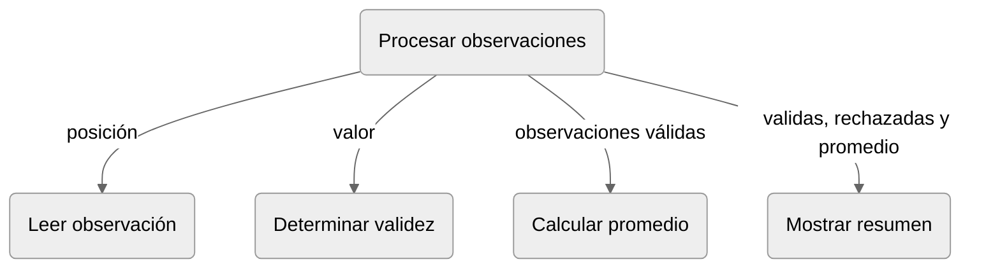

# Diseño descendente **** nombre de la sección

## Diseño descendente

El **diseño descendente** inicia con especificación del problema y refina progresivamente sus tareas hasta obtener unidades que pueden especificarse e implementarse. Cada paso incorpora una decisión de diseño y debe conservar el propósito establecido en el nivel anterior [@wirth1971refinement].

La estrategía de diseño puede adoptar el siguiente procedimiento:

1. Establecer la relación entrada-salida del problema
2. Identificar responsabilidades distinguibles
3. Especificar cada función
4. Representar las dependencias y el flujo previsto de los datos;
5. Implementar y probar aisladamente las funciones
6. Implementar la integración de las unidades
7. Probar la integración

Los pasos tres y cuatro constituyen el **diseño de la composición**, determinan la relación entre las unidades, sin que aún se ensamblen como programa ejecutable. Los pasos seis y siete corresponden a la **implementación de la composición** y a la comprobación de sus interacciones. Esta separación permite probar las funciones elementales antes de incorporarlas a la solución completa.

::::{hint} Ejemplo de diseño de la descomposición funcional.

El [problema](#ejemplo-solucion-monolitica) admite una cantidad entera positiva y, a continuación, esa cantidad de observaciones enteras. Cada observación entre `0` y `100`, incluidos ambos extremos, se incorpora a la lista de valores válidos. Las demás se contabilizan como rechazadas y no intervienen en el promedio. Si no existe ninguna observación válida, el resumen debe indicarlo. Una entrada que no pueda interpretarse como entero queda fuera del dominio de esta versión.

El refinamiento distingue cinco responsabilidades: 
1. Coordinar el procesamiento. 
2. Leer cada observación. 
3. Decidir si la observación leída es válida. 
4. Calcular el promedio cuando esté definido.
5. Mostrar el resumen o reporte.

La  representa estas responsabilidades y las dependencias de datos previstas.

:::{figure} 
:label: fig-cap07-descomposicion-observaciones
:alt: Diagrama jerárquico de las responsabilidades para leer, validar, procesar y reportar observaciones.

Diagrama de dependencias.

_Nota: Las convenciones usadas en el diagrama corresponden a una propuesta expositiva y no necesariamente a una notación de diseño detallado._
:::

::::

