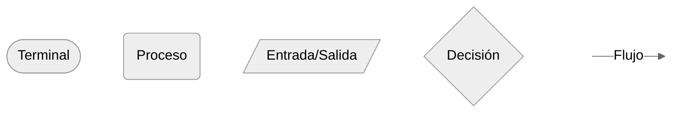
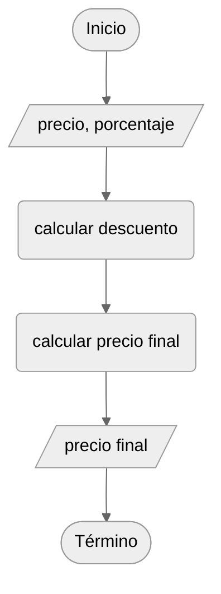

# Diseño y representación

## Propiedades de un algoritmo

Un algoritmo debe definir de manera precisa las operaciones que transforman la entrada en la salida y debe terminar para cada instancia comprendida en su dominio [@cormen2022algorithms]. En un **algoritmo secuencial**, las operaciones se ejecutan una después de otra en el orden establecido. Cada operación puede utilizar los datos o resultados intermedios producidos por las operaciones anteriores.

El orden forma parte del algoritmo. Si una operación utiliza un resultado intermedio, debe ubicarse después de la operación que lo calcula.

## Diagramas de flujo

Los diagramas de flujo representan operaciones y relaciones de control mediante símbolos gráficos. Su elaboración se basa en la norma ISO 5807:1985, que establece símbolos y convenciones para documentar flujos de datos, programas y sistemas [@iso5807].

Aunque ISO 5807 define un repertorio más amplio, en este material docente se emplean cinco símbolos: terminal (inicio o fin), entrada o salida, proceso, decisión y línea de flujo. Este conjunto permite representar los algoritmos estudiados mediante secuencias, decisiones y repeticiones. La suficiencia de estas estructuras para expresar el flujo de control de los algoritmos estructurados se fundamenta en el resultado de @bohm1966.

:::{figure}
:label: fig-simbolos-flujo
:alt: Cinco símbolos utilizados en los diagramas de flujo.

:::

:::{table} Símbolos de ISO 5807 utilizados en este libro.
:label: tab-flowchart
:align: center

| Símbolo                              | Denominación   | Función                                      |
|:-------------------------------------|:---------------|:---------------------------------------------|
| Óvalo o rectángulo redondeado        | Terminal       | Indica el inicio o el término del algoritmo. |
| Paralelogramo                        | Entrada/salida | Representa la lectura o entrega de datos.    |
| Rectángulo                           | Proceso        | Representa una operación o transformación.   |
| Rombo                                | Decisión       | Selecciona una ruta según una condición.     |
| Línea con punta de flecha            | Flujo          | Indica la dirección del flujo de control.    |

:::

Todo diagrama debe presentar un inicio y fin identificables, rutas completas, una dirección de lectura inequívoca y una correspondencia exacta con el algoritmo descrito.

Para simplificar la representación, en este libro se puede la adopta la convención de omitir las etiquetas «Verdadero» y «Falso» cuando la rama correspondiente al resultado verdadero continúa sobre el eje principal del diagrama. En los demás casos, cada etiqueta se sitúa sobre la línea de flujo que sale del rombo, junto a la rama correspondiente.

:::{hint} Ejemplo: Diseño y representación de algoritmos.
:label: ejemplo-diseno_y_representacion

La especificación @ejemplo-analisis_especificacion establece el resultado que debe obtenerse. El diseño descompone esa relación en dos cálculos consecutivos mediante el valor descontado $D$. De esta forma, el algoritmo queda definido por la siguiente secuencia de pasos:

1. Obtener el precio inicial $P$ y el porcentaje de descuento $d$.
2. Calcular el valor de descuento: $D=P\cdot d/100$.
3. Calcular el precio final: $F=P-D$.
4. Comunicar $F$.

:::{figure}
:label: fig-diagrama_descuento
:alt: Diagrama secuencial que obtiene el precio y el descuento, calcula de descuento, calcula el precio final y comunica el resultado.

[//]: # (Diagrama de flujo del algoritmo secuencial para calcular el precio final.)
:::

## Correspondencia especificación/algoritmo

La especificación determina qué relación debe satisfacer el resultado; el algoritmo descompone esa relación en operaciones; y el diagrama representa el orden de ejecución. Las tres descripciones deben ser equivalentes respecto de las entradas admitidas y la salida producida.

La correspondencia se comprueba desde la salida hacia las entradas. En el @ejemplo-diseno_y_representacion, la salida $F$ depende de $P$ y de $D$; a su vez, $D$ depende de $P$ y $d$. El algoritmo calcula esas dependencias en un orden válido y el diagrama conserva ese mismo orden. Ninguna operación puede añadirse, omitirse o cambiarse sin revisar las otras representaciones.

## Errores de representación

Una representación es incorrecta si: 
- altera el orden de las operaciones, 
- utiliza un dato antes de obtenerlo, 
- incorpora pasos ausentes en el algoritmo, 
- omite un cálculo necesario para producir la salida. 

También pierde precisión si emplea símbolos distintos para una misma función o contradice la dirección indicada por las flechas (errores de notación).

## Consistencia de la representación

La revisión de una representación determina si esta corresponde exactamente al algoritmo diseñado. Esta revisión no demuestra la corrección del algoritmo; establece que el diagrama conserva sus operaciones, sus datos y su orden de ejecución. Un diagrama puede representar fielmente un algoritmo que no satisface la especificación.

La revisión comprende las siguientes tareas:
- **Asociar las operaciones:** vincular cada operación del algoritmo con el símbolo que la representa en el diagrama.
- **Comprobar la integridad:** verificar que todas las operaciones del algoritmo aparezcan en el diagrama y que no se hayan incorporado operaciones que no forman parte del diseño.
- **Revisar el orden:** recorrer el flujo de inicio a fin y confirmar que las operaciones mantengan el orden establecido por el algoritmo.
- **Examinar las dependencias de datos:** comprobar que cada dato sea obtenido o calculado antes de utilizarse y que los resultados intermedios estén disponibles cuando sean requeridos.
- **Verificar el recorrido:** confirmar que el inicio y el fin sean inequívocos y que las flechas o flujos establezcan una dirección de ejecución clara.
- **Registrar las discrepancias:** identificar las operaciones omitidas, añadidas o ubicadas en un orden incorrecto y corregir la representación.

El diagrama se considera consistente cuando representa todas las operaciones del algoritmo, conserva su orden y utiliza únicamente datos disponibles en cada punto del recorrido. Una vez establecida esta correspondencia, la corrección del algoritmo debe evaluarse mediante casos de prueba y una justificación de su relación con la especificación.