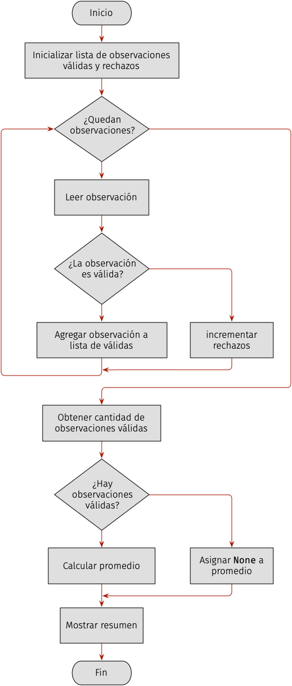

# Composición e integración

## Implementación de la composición

Una vez examinadas de manera aislada las funciones, pueden incorporarse a la 
solución completa. La implementación debe conservar las responsabilidades y los 
intercambios previstos en el diseño descendente). El programa debe reproducir 
las definiciones elementales para que el programa se ejecute como una unidad completa.

La **composición** organiza varias unidades para producir conjuntamente el 
resultado del problema. No modifica la responsabilidad individual de cada función, 
determina cuándo llamarla, qué argumentos suministrarle y cómo utilizar su retorno 
o efecto. En el [ejemplo](#cap07-fig-descomposicion-observaciones), la unidad 
«Procesar observaciones» desempeña la función coordinadora. Conoce la secuencia
general de trabajo, pero delega la lectura y la validación de observaciones, el 
cálculo del promedio y la presentación de los resultados.

La composición debe satisfacer obligaciones que no pertenecen por completo 
a ninguna función elemental. Por ejemplo, para el problema en cuestión y, de 
acuerdo con las [interfaces del problema](cap07-tab-interfaces-problema):

- Toda observación solicitada debe leerse y clasificarse una vez.
- Solo los dentro de rango deben incorporarse a la lista de observaciones válidas.
- La cantidad de rechazos debe incrementarse únicamente cuando la validación produce `False`.
- La unidad que calcula el promedio debe recibir una lista no vacía de valores previamente validados.
- La presentación debe recibir valores coherentes.

Estas obligaciones derivan de las relaciones entre las unidades. Una prueba aislada 
de la unidad «Determinar validez» no puede comprobar, por ejemplo, que la 
coordinación utilice su retorno en la rama correcta.

:::{table} Correspondencia entre funciones y responsabilidades
:label: cap07-tab-funciones-responsabilidades
:align: center

| Función                  | Responsabilidad                         | Resultado o efecto principal                         |
|:-------------------------|:----------------------------------------|:-----------------------------------------------------|
| `leer_observacion`       | obtener una observación                 | retorna un entero y realiza una operación de entrada |
| `es_observacion_valida`  | determinar la validez                   | retorna un valor booleano                            |
| `calcular_promedio`      | calcular el promedio                    | retorna un número                                    |
| `mostrar_resumen`        | comunicar los resultados                | realiza operaciones de salida                        |
| `procesar_observaciones` | coordinar lectura, validación y cálculo | construye los datos requeridos por el resumen        |

:::

Antes de su implementación, la coordinación puede describirse mediante sus 
estados y decisiones principales. Por ejemplo,

(ch7-ejemplo-composicion-lenguaje-natural)=
1. Crear una lista vacía para las observaciones válidas e inicializar en cero la cantidad de rechazos.
2. Repetir la lectura para cada observación.
3. Validar cada observación leída.
4. Si es válida, incorporar el valor leído a la lista de válidas, en caso contrario, incrementar los rechazos.
5. Obtener la cantidad de observaciones válidas a partir de la longitud de la lista.
6. Si la cantidad es mayor que cero, calcular el promedio, en caso contrario, representar su ausencia mediante `None`.
7. Mostrar las cantidades y el promedio.

La lista y el contador de rechazos resumen el procesamiento efectuado hasta 
cada punto del recorrido. Después de procesar una observación, la lista contiene 
los valores válidos hasta ese momento y el contador de rechazos contiene la 
cantidad de valores rechazados. Esta relación permite evaluar sobre la coherencia 
de la coordinación sin atribuir a la función de validación la responsabilidad 
de almacenar o contar resultados.

El siguiente diagrama de flujo representa el control interno del algoritmo.

:::{figure}
:label: cap07-fig-flujo-composicion
:alt: Diagrama de flujo que inicializa la lista y el contador, lee y valida cada observación, agrega o rechaza el valor, calcula el promedio solo si existen valores válidos y muestra el resumen.

  

:::

[//]: # (Una implementación en Python coherente con el algoritmo se presenta a continuación:)

[//]: # ()
[//]: # (:::{code-block} python)

[//]: # (:label: cap07-code-solucion-modular)

[//]: # (:linenos:)

[//]: # ()
[//]: # (:::)

## Pruebas de integración

Una **prueba de integración** examina las interacciones entre funciones conectadas. 
Comprueba que la composición suministre los argumentos adecuados, respete las 
precondiciones, use correctamente los retornos y ejecute las unidades en un orden 
compatible con sus dependencias [@iso29119_1_2022].

Que varias funciones superen sus pruebas aisladas no garantiza que la composición 
sea correcta. Una conexión podría proporcionar argumentos equivocados, omitir 
una llamada, usar incorrectamente un retorno o invocar una función cuando su 
precondición no se satisface.

La selección de casos de integración se guía por **interacciones**, no por 
funciones consideradas separadamente. Por ejemplo, en [la implementación](cap07-code-solucion-modular) 
se debe examinar al menos tres situaciones:

:::{table} Ejemplo de pruebas de integración
:label: tab-cap07-pruebas-integracion
:align: center

| Observaciones      | Interacción examinada                                                           | Resultado esperado                               |
|:-------------------|:--------------------------------------------------------------------------------|:-------------------------------------------------|
| `80, -1, 100, 140` | La validación produce ambos resultados y el promedio recibe una lista no vacía. | 2 válidas, 2 rechazadas y promedio `90.0`.       |
| `-1, 101`          | Ninguna observación es válida. Debe omitirse la llamada al promedio.            | 0 válidas, 2 rechazadas y promedio no calculado. |
| `0, 100`           | Los dos límites se transmiten al promedio.                                      | 2 válidas, 0 rechazadas y promedio `50.0`.       |

:::

El resultado esperado se determina a partir de la especificación global y de 
las conexiones previstas. Solo después se ejecuta el programa completo y se 
registra la salida obtenida.

El primer caso activa todas las conexiones. El segundo comprueba que la 
coordinación no infrinja la precondición del promedio. El tercero examina la 
transmisión de valores límite. No es necesario repetir todas las pruebas aisladas 
durante la integración si no aportan información nueva sobre las conexiones.
