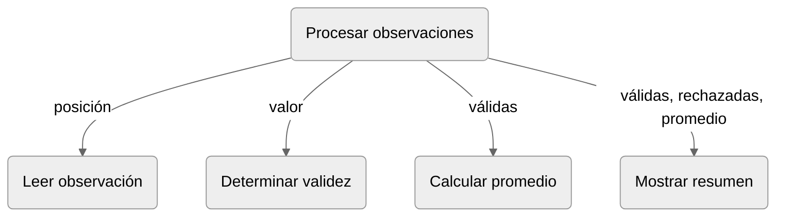

## Desarrollo de una solución modular

El **diseño descendente** refina progresivamente la especificación global en 
responsabilidades, interfaces y relaciones entre unidades. Cada refinamiento 
añade detalle y debe conservar el propósito del nivel anterior. La 
implementación de las funciones y sus pruebas son actividades que no 
constituyen, por sí mismas, pasos del refinamiento [@wirth1971refinement; @felleisen2018design].

El diseño descendente forma parte de una secuencia más amplia que comprende 
diseño, implementación y comprobación. Para conservar una visión conjunta del 
proceso, se adopta la siguiente secuencia:

(ch7-estrategia-diseno-descendente)=
1. Establecer la relación entre las entradas y los resultados del problema global.
2. Identificar responsabilidades distinguibles.
3. Especificar las funciones correspondientes.
4. Representar sus dependencias y el flujo previsto de los datos.
5. Implementar y probar aisladamente las funciones de cálculo.
6. Implementar la composición de las unidades.
7. Probar la integración.

Los cuatro primeros pasos corresponden al diseño de la solución modular. El 
quinto vincula las especificaciones individuales con sus implementaciones. 
Los dos últimos construyen y comprueban las conexiones. Esta separación permite 
probar las funciones elementales antes de incorporarlas a la solución completa.

## Refinamiento de la solución

**Refinar una solución** consiste en sustituir una formulación global por otra más 
detallada que conserve su propósito. El nivel superior expresa el resultado 
que debe producirse, los niveles siguientes precisan las responsabilidades que 
colaboran y las relaciones que deben cumplirse. El proceso se detiene cuando 
cada responsabilidad puede implementarse mediante las construcciones conocidas [@wirth1971refinement].

En el [problema](#ch7-problema-conductor), el refinamiento adoptado distingue las mismas [cinco 
responsabilidades](#ch7-ex-descomposicion) establecidas durante la descomposición:

:::{table} Ejemplo de niveles de refinamiento de una solución modular
:label: cap07-tab-niveles-refinamiento
:align: center

| Nivel                                          | Formulación                                                                     |
|:-----------------------------------------------|:--------------------------------------------------------------------------------|
| Problema (relacion entrada-salida)             | Procesar observaciones e informar válidas, rechazadas y promedio cuando exista. |
| Responsabilidades (tareas distinguibles)       | Leer, validar, calcular, presentar y coordinar.                                 |
| Interfaces (uso de cada unidad)                | Datos requeridos, retornos, efectos y restricciones de cada unidad.             |
| Dependencias (solución a partir de las partes) | Llamadas previstas y datos que relacionan las unidades.                         |
| Algoritmos internos (tarea de cada unidad)     | Operaciones conocidas que implementan cada responsabilidad.                     |

:::

En el refinamiento cada decisión debe justificarse mediante la especificación 
del nivel anterior. Por ejemplo, en el [problema](#ch7-problema-conductor), la existencia de 
observaciones rechazadas justifica una operación de validación, la necesidad de 
informar un promedio justifica una función de cálculo, la entrada repetida 
justifica una coordinación que controle el recorrido por cada entrada. Por otra 
parte, una función adicional que no produzca ningún dato ni efecto requerido 
carecería de una responsabilidad derivada del problema.

## Especificaciones locales

La especificación global establece propiedades de la solución completa. Para 
diseñar las funciones se distribuyen esas propiedades entre unidades, sin 
perder ninguna de ellas.

Por ejemplo, 
- La necesidad de identificar que una observación pertenece a un intervalo específico, origina una llamada a una unidad que valide las observaciones.
- Que solo las observaciones válidas son consideradas para el cálculo del promedio, requiere la creación de una lista separada antes de llamar a la función que calcula el promedio.
- Para poder mostrar el promedio únicamente cuando exista al menos una observación válida, requiere a comprobar que la lista de observaciones válidas no esté vacía.
- Para mostrar las cantidades de observaciones válidas y rechazadas, se requiere que la coordinación produzca ambas cantidades y que la unidad de presentación las reciba.

Esta distribución permite distinguir dos clases de obligaciones: local y de 
composición (global). Una obligación local puede satisfacerse dentro de una función, por 
ejemplo, la función que calcula el promedio debe devolver la suma de los elementos 
dividida por su cantidad. Una obligación de composición depende de las conexiones, 
por ejemplo, la coordinación del procesamiento de observaciones debe evitar calcular 
el promedio con una lista vacía. Las pruebas aisladas examinan principalmente 
obligaciones locales, mientras que, las pruebas de integración se dirigirán a 
las obligaciones de composición.

La siguiente tabla resume las interfaces previstas antes de escribir la coordinación
del [problema](#ch7-problema-conductor):

:::{table} Interfaces problema procesamiento de observaciones.
:label: cap07-tab-interfaces-problema
:align: center

| Unidad                 | Datos requeridos               | Resultado o efecto                                | Restricción                                                                    |
|:-----------------------|:-------------------------------|:--------------------------------------------------|:-------------------------------------------------------------------------------|
| Leer observación       | Posición                       | Lee y retorna un entero                           | La entrada debe poder convertirse a entero.                                    |
| Determinar validez     | Entero                         | Retorna booleano                                  | Admite enteros dentro y fuera del intervalo válido.                            |
| Calcular promedio      | Lista de enteros válidados     | Retorna el promedio                               | La lista no puede estar vacía.                                                 |
| Mostrar resumen        | Cantidades y promedio o `None` | Muestra el resumen                                | No vuelve a validar ni calcular. Por lo tanto, los datos deben ser coherentes. |
| Procesar observaciones | Cantidad positiva              | Coordina lectura, clasificación, cálculo y salida | Debe producir datos coherentes con todas las observaciones leídas.             |

:::

## Dependencias entre funciones

Una solución modular no queda completamente descrita al enumerar sus funciones, 
se requiere además, establecer qué función necesita los resultados o efectos de 
otra. Existe una **dependencia** cuando una unidad requiere que otra proporcione 
un dato, realice una acción o satisfaga una condición necesaria para continuar 
la solución. La selección deliberada de la información y las decisiones que 
pertenecen a cada unidad es un aspecto central de la descomposición modular [@parnas1972criteria].

Un **diagrama de dependencias** es una representación de las unidades funcionales 
y de las relaciones de uso previstas entre ellas, y su propósito es busca identificar 
y representar,
- unidades conforman la solución,
- dependencia de una unidad respecto de otras,
- dato que se transmite mediante la relación.

El siguiente diagrama de dependencias conserva la especificación del problema.

:::{figure}
:label: cap07-fig-dependencias-problema
:alt: Jerarquía de responsabilidades para coordinar, leer, validar, calcular el promedio y mostrar el resumen de observaciones.

Diagrama de dependencias para el procesamiento modular del [ejemplo](#ch7-problema-conductor). 
Representa las [dependencias](#cap07-tab-interfaces-problema) entre las unidades.
:::

::::{dropdown} Notación del diagrama de dependencias

:::{table} Notación diagrama de dependencias
:label: cap07-notacion-diagrama-de-dependencias
:align: center

| Elemento               | Descripción                                                                   |
|:-----------------------|:------------------------------------------------------------------------------|
| Nodo                   | Responsabilidad que se implementará mediante una función o un procedimiento.  |
| Flecha                 | Dependencia entre unidades mediante una llamada.                              |
| Rótulo de la flecha    | Dato que la operación llamadora proporciona o que interviene en la relación.  |
| Nodo de origen         | Unidad coordinadora desde la cual se inicia la lectura jerárquica del diseño. |

:::

La flecha expresa una relación de uso, no describe necesariamente todos los 
argumentos ni el valor retornado. Estos elementos forman parte de la interfaz y 
la especificación de cada función. El rótulo destaca solo la información 
necesaria para interpretar la dependencia en el nivel de diseño mostrado.

::::

El componente encargado de coordinador el procesamiento (unidad coordinadora), 
proporciona la posición a la lectura de observaciones y recibe una observación. 
Entrega ese valor a la validación y, según el resultado, lo incorpora a la 
colección o aumenta la cantidad de rechazos. Solo cuando la colección contiene 
elementos la coordinación la entrega al cálculo del promedio. Finalmente, 
transmite las cantidades y el promedio (o la ausencia de este) a la presentación.

Las flechas en el diagrama no establecen por sí solas cuántas veces se efectúa 
cada llamada. Por ejemplo, la lectura y la validación se ejecutarán una vez por 
observación, pero esa repetición no aparece en el diagrama de dependencias. 
Tampoco se representa la decisión que evita calcular el promedio cuando la 
lista está vacía. Ambas relaciones pertenecen al flujo de control interno de la 
coordinación.

Las pruebas aisladas de las funciones deben realizarse antes de 
implementar estas conexiones.