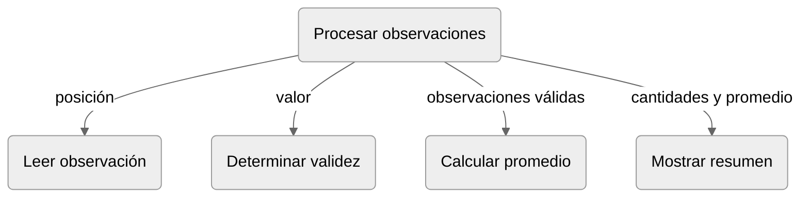

El **diseño descendente** parte de la especificación del problema y refina progresivamente sus tareas hasta obtener unidades que pueden especificarse e implementarse. Cada paso incorpora una decisión de diseño y debe conservar el propósito establecido en el nivel anterior [@wirth1971refinement].

Para problemas pequeños es posible adoptar el siguiente procedimiento:

1. Establecer la relación entre las entradas y los resultados del problema.
2. Identificar responsabilidades distinguibles.
3. Especificar las funciones correspondientes.
4. Representar sus dependencias y el flujo previsto de los datos.
5. Implementar y probar aisladamente las funciones de cálculo.
6. Implementar la composición de las unidades.
7. Probar la integración.

Los pasos tercero y cuarto forman parte del **diseño de la composición**, determinan cómo se relacionarán las unidades sin ensamblarlas todavía como programa ejecutable. Los pasos sexto y séptimo corresponden a la implementación de esa composición y a la comprobación de sus interacciones. Esta separación permite probar las funciones elementales antes de incorporarlas a la solución completa.

En el [problema](#ch7-problema-conductor), la especificación global admite una cantidad de observaciones enteras. Cada observación entre `0` y `100` se incorpora a la colección de valores válidos, las demás se contabilizan como rechazadas. Si la colección queda vacía, no debe llamarse a la función de promedio.

El refinamiento adoptado distingue las mismas cinco responsabilidades establecidas durante la descomposición:

1. Coordinar el procesamiento
2. Leer cada observación
3. Determinar si la observación es válida
4. Calcular el promedio cuando esté definido
5. Mostrar el resumen

La  representa las dependencias de datos entre esas responsabilidades. No representa todavía el flujo de control detallado de la implementación.

:::{figure}
:label: cap07-fig-descomposicion-observaciones
:alt: Jerarquía de responsabilidades para coordinar, leer, validar, calcular el promedio y mostrar el resumen de observaciones.

Dependencias previstas en el procesamiento modular de observaciones.
:::

La coordinación proporciona la posición a la lectura de observaciones y recibe una observación. Entrega ese valor a la validación y, según el resultado booleano, lo incorpora a la colección o aumenta la cantidad de rechazos. Solo cuando la colección contiene elementos la coordinación la entrega al cálculo del promedio. Finalmente, transmite las cantidades y el promedio (o la ausencia de este) a la presentación.

El diagrama conserva la especificación global: toda observación se clasifica una vez, solo las válidas intervienen en el promedio y la función de cálculo no recibe una lista vacía. Las pruebas aisladas de las funciones deben realizarse antes de implementar estas conexiones.

