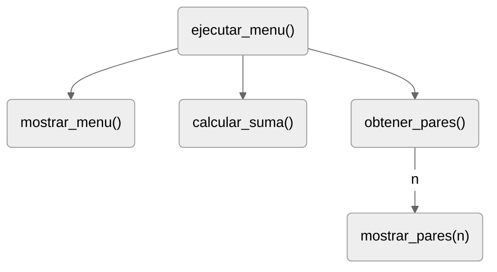

# Solución refactorización (CFI-008)

## Paso 1. Análisis del problema (Especificación global)

El programa debe atender solicitudes de suma y presentación de números pares 
mediante un menú interactivo. La interacción debe continuar hasta que el 
usuario seleccione la opción de salida.

### Entradas y resultados

| Operación | Datos necesarios | Resultado o efecto |
|:---|:---|:---|
| Seleccionar una opción | Opción ingresada como texto | Ejecutar una operación, informar un error o terminar |
| Sumar | Dos números | Mostrar su suma |
| Mostrar pares | Un entero positivo `n` | Mostrar los pares comprendidos entre 1 y `n`, inclusive |
| Rechazar un `n` no positivo | Entero `n ≤ 0` | Mostrar un error y volver al menú |
| Salir | Opción `"3"` | Terminar el ciclo y mostrar el mensaje de finalización |

**Supuestos**

- Los operandos ingresados pueden convertirse a números y el valor ingresado para `n` puede convertirse a entero. 
- No se supone que `n` sea positivo, en consecuencia, el programa debe comprobar esa condición y responder adecuadamente cuando no se cumpla.

### Refinamiento de la solución

En el siguiente refinamiento se identifican tareas:

```text
Atender solicitudes del usuario
├── Presentar opciones de menú
├── Leer la opción ingresada
├── Determinar la acción correspondiente a la opción
│   ├── Informar una opción inválida
│   ├── Resolver una solicitud de suma
│   │   ├── Solicitar los operandos
│   │   ├── Calcular la suma
│   │   └── Mostrar el resultado
│   ├── Resolver una solicitud de pares
│   │   ├── Solicitar n
│   │   ├── Comprobar que n es positivo
│   │   └── Informar el error o mostrar los pares entre 1 y n 
│   └── Terminar
└── Repetir mientras no se ingrese "3" (Salir)
```

Las decisiones principales son:

- Una opción desconocida produce un error y continúa con la siguiente iteración.
- La opción `"3"` termina el ciclo.
- Las opciones `"1"` y `"2"` seleccionan la operación correspondiente.
- Un `n` positivo permite mostrar pares; cualquier otro valor produce un error.

## Paso 2. Propuesta de organización

:::{table} Responsabilidades + interfaces
:label: ch7-solucion-refactorizacion

| Función (unidad) | Responsabilidad | Parámetros | Retorno o efecto observable | Condición de uso |
|:---|:---|:---|:---|:---|
| `mostrar_menu()` | Presenta las opciones | - | Muestra el menú | - |
| `calcular_suma()` | Resuelve solicitud de suma | - | Solicita operandos y muestra su suma | Entradas convertibles a números |
| `obtener_pares()` | Resuelve solicitud de pares | - | Solicita `n`, comprueba su validez e informa el error o delega la presentación | Entrada convertible a entero |
| `mostrar_pares(n)` | Muestra pares entre `1` y `n` | `n` (`int`) | Muestra los números pares | `n > 0` |
| `ejecutar_menu()` | Coordina selección, repetición y salida | - | Lee opciones y llama a las operaciones | Respetar supuestos de entrada |
:::

:::{figure}
:label: cap07-fig-dependencias-refactorizacion
:alt: Daiagrama de dependencias, problema refactorización.
:align: center

Diagrama de dependencias
:::

- Las operaciones de suma y pares son mutuamente excluyentes. 
- La llamada a `mostrar_pares(n)` depende de `n > 0`.

### Secuencia de coordinación (lenguaje natural)

1. Mostrar el menú.
2. Leer una nueva opción.
3. Si la opción es inválida, informar el error y continuar con siguiente iteración.
4. Si la opción es `"3"`, terminar el ciclo.
5. Si la opción es `"1"`, llamar a `calcular_suma()`.
6. En el caso restante, llamar a `obtener_pares()`.
7. Repetir desde el paso 1.
8. Al salir del ciclo, mostrar el mensaje de finalización.

## Paso 3. Refactorización el programa

1. Implementación de funciones
2. Pruebas aisladas
3. Composición
4. Pruebas de integración


## Paso 4. Pruebas de integración

Cada secuencia corresponde a una ejecución independiente. Los datos se ingresan uno por uno, cuando el programa los solicita.

| # | Entradas en orden | Esperado | Interacción comprobada |
|---:|:---:|---|---|
| 1 | `5 → 1 → 8 → 5 → 2 → 10 → 3` | Error: `"Opción inválida"`, suma: `13.0`, pares: `4 6 8`, `"Programa finalizado"` | Recuperación tras el error, selección de ambas operaciones y regreso al menú |
| 2 | `2 → 0 → 1 → 4 → 6 → 3` | Error: `Error: n debe ser positivo.`, suma: `10.0`, `"Programa finalizado"` | Rechazo de cero y devolución del control sin terminar el menú |
| 3 | `2 → 1 → 2 → 2 → 3` | rótulo sin números; para `n = 2`, muestra `2`; finalización | Nueva lectura del argumento y tratamiento del límite inclusivo |
| 4 | `3` | Finalización sin solicitar operandos ni `n` | Salida inmediata, sin ejecutar operaciones |
| 5 | `2 → -4 → 2 → 5 → 3` | Error por `n = -4`; después muestra `2 4`; finalización | Rechazo de un negativo, nueva lectura y recorrido con límite impar |

El caso adicional permite detectar, por ejemplo, una comprobación que rechace únicamente cero y deje pasar valores negativos, o una coordinación que conserve el argumento de una solicitud anterior.
