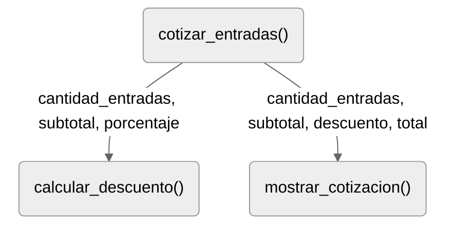

# Problemas de descomposición y composición de funciones

## Descripción

Resuelva los problemas mediante una función principal y las funciones auxiliares 
que consideren necesarias.

Para cada ejercicio, genere:

- Una descomposición breve, con la responsabilidad e interfaces.
- Un diagrama de dependencias coherente con la solución.
- Implementación de la solución modular.
- Tres pruebas de integración.

Los ejercicios aumentan progresivamente en dificultad.

## PMOD-001. Cotización de entradas

Una sala necesita cotizar la compra de entradas para una función. La entrada 
general cuesta \$6000 y la entrada de estudiante cuesta \$4000. Las compras de 
cinco o más entradas reciben un descuento del 10% sobre el subtotal completo.

Desarrolle un programa que solicite las cantidades de entradas generales y de
estudiante y presente una cotización con:

- Cantidad total de entradas.
- Subtotal antes del descuento.
- Monto del descuento.
- Total a pagar.

Si alguna cantidad ingresada es negativa o cero, el programa deberá informar 
que la compra no es válida y terminar sin mostrar una cotización.

::::{dropdown} Solución

### Análisis del problema

**Especificación global** 

Cotizar una compra de entradas, aplicando un 
descuento cuando corresponda

|                       |                                                                            |
|----------------------:|:--------------------------------------------------------------------------------------|
|             Entradas: | entradas generales (`int`) y de estudiante (`int`)                                    |
| Condición de validez: | ambas entradas deben ser mayor que cero                                               | 
|              Salidas: | cantidad total (`int`), subtotal (`int`), descuento (`int`) y total por pagar (`int`) |
|                       |                                                                            |

**Relaciones entre los datos**

Cálculos de la cotización:

```python
 cantidad_total = generales + estudiantes
       subtotal = generales * 6000 + estudiantes * 4000
      descuento = 0.1 * subtotal, si cantidad total ≥ 5
total_por_pagar = subtotal − descuento
```

**Descomposición en tareas**

```text
Cotizar entradas
├── Solicitar las cantidades
├── Comprobar la validez de la compra
│   ├── Compra inválida: informar y terminar
│   └── Compra válida:
│       ├── Calcular la cantidad total de entradas
│       ├── Calcular el subtotal a pagar
│       ├── Calcular el descuento 
│       ├── Calcular el total a pagar
│       └── Mostrar la cotización

```

### Organización

**Obligaciones y dependencias**

- La coordinación conserva las operaciones aritméticas sencillas. 
- El descuento se separa porque representa una regla de la compra.
- La presentación reúne el formato de salida.

| Función                  | Responsabilidad                                                                              | Parámetros                                                                 | Retorno o efecto observable |
|:-------------------------|:---------------------------------------------------------------------------------------------|:---------------------------------------------------------------------------|:----------------------------|
| `cotizar_compra()`       | captura entradas, validar entradas, mostrar error, calcular cantidad total, subtotal y total | -                                                                          | solicitar entradas          |
| `calcular_descuento()`   | calcula el descuento por entradas                                                            | `total_entradas`:`int`, `subtotal`: `int`, `porcentaje`: `0 < float < 100` | descuento                   |
| `mostrar_cotizacion()`   | muestra cantidad total, subtotal, descuento y total                                          | `cantidad_total`, `subtotal`, `descuento`                                  | muestra salidas             |

**Dependencias**

:::{figure}
:label: cap07-fig-dependencias-PMOD-001
:alt: Daiagrama de dependencias, problema PMOD-001.
:align: center

Diagrama de dependencias
:::

**Secuencia de coordinación**

1. Solicitar cantidades. 
2. Comprobar que sean positivas. 
3. Si alguna no lo es, informar el error y terminar. 
4. Si ambas son positivas, calcular la cantidad total y el subtotal.
5. Calcular el descuento. 
6. Utilizar el descuento retornado para obtener el total por pagar.
7. Mostrar la cotización.

### Refactorización

### Pruebas de integración

| Caso                        | General | Estudiante | Resultado esperado                                      | Interacción examinada                                                             |
|:----------------------------|:-------:|:----------:|:--------------------------------------------------------|:----------------------------------------------------------------------------------|
| Compra mínima válida        |    1    |     1      | 2 entradas, subtotal 10000; descuento 0, total 10000    | La validación permite continuar y los datos llegan a la presentación              |
| Bajo el umbral              |    2    |     2      | 4 entradas, subtotal 20000; descuento 0, total 20000    | El retorno cero del descuento conserva el subtotal como total                     |
| En el umbral                |    3    |     2      | 5 entradas, subtotal 26000; descuento 2600, total 23400 | Se aplica el descuento desde cinco entradas y se utiliza correctamente su retorno |
| Sobre el umbral             |    2    |     4      | 6 entradas, subtotal 28000; descuento 2800, total 25200 | Se mantiene el descuento para cantidades superiores a cinco                       |
| Cantidad general cero       |    0    |     3      | Mensaje de compra inválida, sin cotización              | La coordinación omite las llamadas posteriores                                    |
| Cantidad de estudiante cero |    2    |     0      | Mensaje de compra inválida, sin cotización              | Se comprueba también la segunda cantidad                                          |
| Cantidad negativa           |   -1    |     2      | Mensaje de compra inválida, sin cotización              | Se rechazan valores negativos antes de calcular                                   |

::::


## PMOD-002. Análisis de palabras

Se requiere un resumen de las palabras utilizadas en un manuscrito. Desarrolle 
un programa que solicite una cantidad positiva de palabras y luego lea exactamente 
esa cantidad de entradas.

Se considera válida una entrada que contenga al menos un carácter y esté 
formada exclusivamente por letras minúsculas de `a` a `z`. No se incluyen 
tildes ni la letra ñ. Una entrada vacía o con espacios, dígitos u otros 
caracteres se cuenta como rechazada y no se reemplaza por una nueva lectura.

Al finalizar, el programa deberá mostrar:

- Cantidad de palabras válidas y de entradas rechazadas.
- Total de vocales presentes en las palabras válidas, contando cada aparición de `a`, `e`, `i`, `o` y `u`.
- La palabra válida más larga y su longitud. Si existe un empate, conserven la primera ingresada.

Si no hay palabras válidas, el programa deberá informar esta situación, mostrar 
cero vocales y omitir la palabra más larga y su longitud. Si la cantidad 
inicial no es positiva, el programa deberá mostrar un error y terminar sin 
solicitar palabras.

## PMOD-003. Tarifa de despachos

Una empresa necesita cotizar varios paquetes. Desarrolle un programa que 
solicite la cantidad de paquetes y, para cada uno, su peso en kilogramos y la
zona de destino.

Un paquete se acepta si su peso es mayor que cero y no supera los 20 kg, y su
zona es `L` (local) o `R` (regional). Las letras deben ingresarse en 
mayúscula. El programa deberá leer ambos datos de cada paquete antes de 
clasificarlo. Un paquete con uno o ambos datos inválidos se cuenta como un 
único rechazo y no se cotiza.

La tarifa por peso es la siguiente:

| Peso                      | Tarifa base |
|:--------------------------|------------:|
| Mayor que 0 y hasta 1 kg  |      \$2500 |
| Mayor que 1 y hasta 5 kg  |      \$4000 |
| Mayor que 5 y hasta 20 kg |      \$7000 |

Despachos para la zona regional, tiene un recargo de \$2000 a la tarifa base. 
Para zona local no tiene recargo.

Al finalizar, el programa deberá mostrar el costo de cada paquete aceptado o el
rechazo correspondiente. Presentar las cantidades de paquetes aceptados y 
rechazados y el costo total de los despachos aceptados. Si todos son 
rechazados, el costo total es cero.

Si la cantidad inicial no es positiva, se deberá mostrar un error y terminar. 
No se vuelven a solicitar los datos de un paquete rechazado.

## PMOD-004. Sistema votación

Desarrolle un programa que registre los votos de una elección entre las 
opciones `A`, `B` y `C`. El ingreso de votos termina cuando se introduce `FIN`.

Cada entrada debe tratarse de la siguiente manera:

- `A`, `B` o `C`: suma un voto a la opción indicada.
- Cualquier otro texto: suma un voto nulo.
- `FIN`: termina el ingreso y no cuenta como voto.

Las entradas se distinguen exactamente como están escritas: por ejemplo, `a` es
un voto nulo.

Al finalizar, el programa deberá mostrar el resultado de las votaciones, es 
decir, los votos de cada opción, los votos nulos, el total de votos registrados
y el porcentaje de cada opción respecto del total de votos válidos. Los votos
nulos no forman parte del denominador del cálculo de porcentajes.

Además, el programa deberá identificar como opción ganadora la alternativa que 
contabilice la mayor cantidad de votos. Si dos o tres opciones comparten la
mayor cantidad, deberá mostrar las opciones empatadas. Si no se registran votos 
válidos, deberá mostrar que no puede determinarse un resultado y se omiten los
porcentajes y la declaración de ganador o empate.

El programa debe admitir que la primera entrada sea `FIN`. Los porcentajes 
pueden mostrarse con hasta dos decimales. Pequeñas diferencias en su suma 
debidas al redondeo son aceptables.