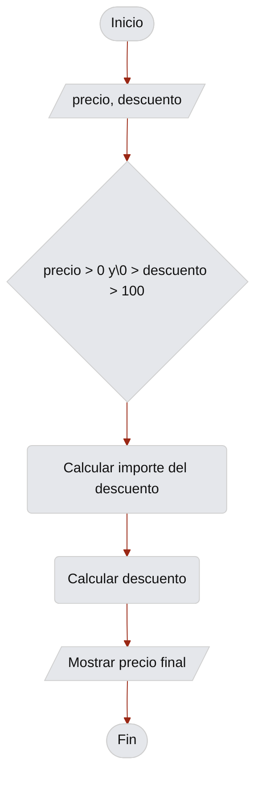

# Resolución de problemas y algoritmos

Un **algoritmo** es un procedimiento computacional definido que transforma datos de entrada en resultados de salida; para resolver un problema, debe describir una secuencia de operaciones aplicable a sus instancias. Un **programa** expresa uno o más algoritmos en un lenguaje de programación y permite su ejecución por un computador [@cormen2022algorithms;@kumar2024cs2023]. Se distinguen tres etapas:

1. **Análisis y especificación:** precisar el problema, sus entradas, sus salidas, sus restricciones y sus supuestos.
2. **Diseño y representación:** construir el algoritmo y expresarlo de una manera que permita examinarlo.
3. **Implementación:** traducir el algoritmo a un lenguaje de programación.

## Pensamiento computacional

Un **problema computacional** establece la relación que debe obtenerse entre datos de entrada y un resultado. Una **instancia** es un caso concreto del problema, determinado por valores de entrada particulares [@cormen2022algorithms]. Por ejemplo, determinar el mayor de tres números es un problema, determinar el mayor entre 7, 2 y 9 es una instancia.

Resolver computacionalmente un problema exige formular un procedimiento que pueda aplicarse a todas las instancias admitidas, no solo a un ejemplo particular. El resultado producido para una instancia durante una ejecución es distinto del algoritmo general que lo produce.

El **pensamiento computacional** reúne prácticas para formular problemas y diseñar soluciones expresables con precisión. @wing2006computational lo vincula con la resolución de problemas mediante conceptos fundamentales de la informática y destaca la abstracción y la descomposición. Por su parte, @shute2017computational identifica la descomposición, la abstracción y el diseño de algoritmos.

Operativamente, el proceso puede adoptar descomposición, reconocimiento de regularidades, abstracción y diseño algorítmico:

- La **descomposición** divide un problema en partes manejables.
- El **reconocimiento de regularidades** identifica propiedades comunes entre instancias o partes del problema. 
- La **abstracción** conserva la información que determina la solución y excluye los detalles irrelevantes. 
- El **diseño algorítmico** organiza las operaciones resultantes en un procedimiento preciso.

:::{hint} Ejemplo
Un evento social cobra un precio fijo por entrada y se desea calcular el costo total para un grupo. El proceso podría quedar establecido por:

1. **Descomposición.** El problema requiere determinar la cantidad de entradas, establecer el precio unitario, calcular el producto de ambos valores y comunicar el total.
2. **Abstracción.** No son relevantes los nombres de las personas ni el orden en que ingresan. Sí son relevantes la cantidad de entradas y el precio unitario.
3. **Regularidad.** El mismo cálculo se aplica a cualquier grupo que cumpla las restricciones.
4. **Diseño algorítmico inicial.** Si $n$ representa la cantidad de entradas y $p$ el precio unitario, el costo total ($C$) queda definido por,

$$C = n \cdot p$$
:::

Antes de aceptar este diseño deben precisarse las condiciones de los datos: si la cantidad puede ser cero, qué valores son inválidos y qué incluye el precio. Esta tarea corresponde a la especificación.

Para analizar otro caso del mismo tipo, primero se formula el problema general sin valores particulares. A continuación, se construye una instancia con datos concretos y se separan los datos que intervienen en el cálculo de los detalles contextuales que no modifican el resultado. El procedimiento termina al registrar los supuestos que deben confirmarse antes de diseñar el algoritmo.

Un análisis es incorrecto si confunde el resultado de una instancia con una solución general, si conserva detalles narrativos que no afectan el resultado o si formula operaciones antes de precisar qué debe calcularse. Un algoritmo tampoco requiere ejecución automática para ser estudiado, puede ejecutarse manualmente durante su análisis.

## Especificación del problema

Una **especificación** define las condiciones que deben satisfacer los datos de entrada y los resultados esperados, independiente del procedimiento utilizado para obtenerlos. Esta separación entre condiciones iniciales y propiedades finales se fundamenta en el método axiomático de @hoare1969axiomatic. La especificación se estructura mediante los siguientes elementos:

1. **Entradas:** datos que recibe el algoritmo.
2. **Salidas:** resultados que debe producir.
3. **Restricciones:** condiciones que limitan los datos admitidos o la solución.
4. **Supuestos:** condiciones aceptadas como válidas para acotar el problema.
5. **Relación entrada-salida:** propiedad que debe cumplir el resultado.

Posteriormente, estas ideas podrán formalizarse mediante **precondiciones**, que describen las condiciones previas a la ejecución, y **poscondiciones**, que expresan las propiedades requeridas al finalizar.

## Proceso de resolución de problemas

Metodológicamente, el proceso puede ser organizado en cinco pasos. Esta separación permite controlar que cada decisión del diseño proceda de una condición ya establecida y que la prueba evalúe la solución solicitada.

1. **Delimitar el problema.** Identificar el resultado requerido y distinguir el problema general de sus instancias.
2. **Especificar el problema.** Definir entradas, salidas, restricciones, supuestos y la relación matemática o lógica que debe satisfacerse.
3. **Diseño del algoritmo.** Descomponer la relación requerida en operaciones elementales y ordenarlas mediante secuencia, decisiones o repeticiones.
4. **Representar el flujo de control.** Construir un diagrama (por ejemplo, [diagrama de flujo](note-flowchart)) cuya estructura coincida exactamente con las operaciones identificadas.
5. **Verificar la solución.** Ejecutar pruebas con casos normales, límite e inválidos, comparar los resultados con la especificación y justificar las propiedades que las pruebas no pueden demostrar por sí solas.

La **implementación** solo procede después de completar estas fases. Cuando no se utiliza un lenguaje de programación, los datos y las operaciones se expresan mediante notación algebraica.

:::{note} Diagramas de flujo 👈
:class: dropdown
:label: note-flowchart
👋 This could be a solution to a problem or contain other detailed explanations.
:::

:::{hint} Ejemplo
Calcular el valor que debe pagar una persona por un producto al que se aplica un descuento porcentual.

**Paso 1.** Delimitación del problema

El problema consiste en determinar el valor final de un producto después de aplicar un descuento expresado como porcentaje de su precio inicial.

El problema general comprende cualquier producto cuyo precio y porcentaje de descuento satisfagan las restricciones establecidas. Una instancia queda determinada por valores concretos. Por ejemplo, un producto con un precio inicial de 80 unidades monetarias y un descuento del 25 % constituye una instancia del problema.

El resultado requerido es el valor que debe pagarse después de descontar del precio inicial el descuento correspondiente al porcentaje indicado.

**Paso 2.** Especificación del problema

- **Entradas:** precio inicial ($P$) y porcentaje de descuento ($d$).
- **Salida:** precio final ($F$).
- **Restricciones:** los datos de entrada deben satisfacer las siguientes restricciones: $P \geq 0$ y $0 \leq d \leq 100$.
- **Supuestos:** se supone que el precio inicial y el porcentaje de descuento están expresados en unidades compatibles con las operaciones definidas. No se consideran impuestos, ni reglas de redondeo monetario.
- **Relación esperada:** el valor de descuento ($D$) se determina mediante la relación:
$$ D=P\frac{d}{100} $$
El precio final mediante:
$$F=P-D$$
Al sustituir $D$, se obtiene una expresión equivalente:
$$
F=P\left(1-\frac{d}{100}\right)
$$
La salida debe ser un valor $F$ comprendido en el intervalo
$$
0\leq F\leq P.
$$

**Paso 3.** Diseño del algoritmo

La relación matemática permite derivar una secuencia de cuatro operaciones:

1. Obtener el precio inicial $P$ y el porcentaje de descuento $d$. 
2. Comprobar si se cumplen las condiciones $P\geq0$ y $0\leq d\leq100$. 
3. Si alguna condición no se cumple, informar que los datos son inválidos y terminar. 
4. Calcular el precio final mediante $F=P(1-d/100)$.
5. Comunicar el precio final $F$.

**Paso 4.** Representación del algoritmo

(flowchart-ejemplo_1)=

:::