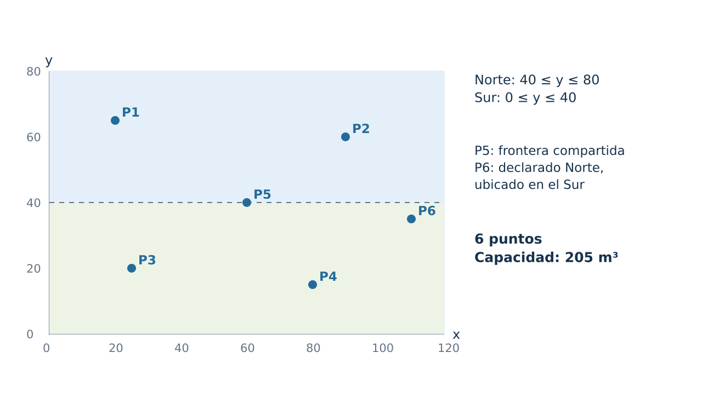
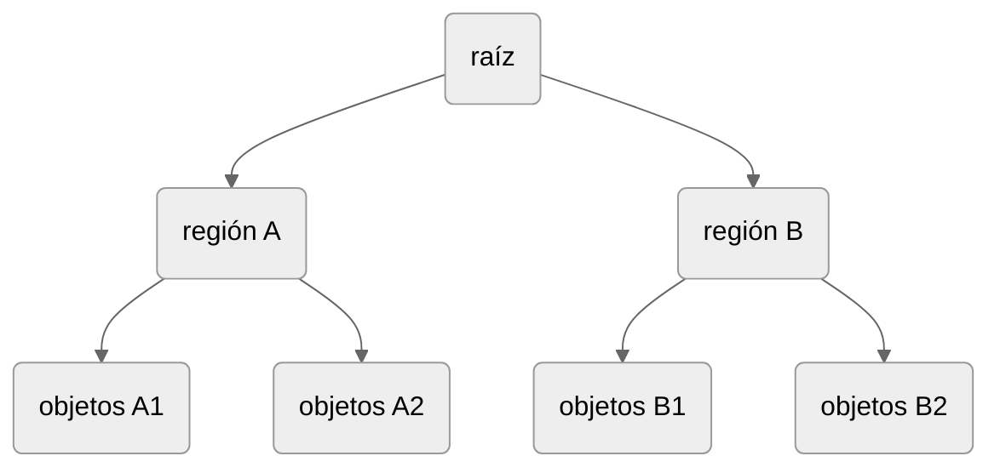
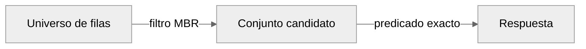

:::{dropdown} Resultados de aprendizaje (R1-R4)

1. Calcular y representar un MBR e identificar qué información geométrica pierde.
2. Explicar cómo un R-tree utiliza regiones envolventes para descartar ramas.
3. Construir un filtro conservador y un refinamiento exacto, justificando que se conserva el conjunto resultado.
4. Crear e inspeccionar un índice espacial en una tabla de prueba y distinguir su existencia de su utilización.
5. Interpretar evidencia básica de `EXPLAIN` y comparar resultados y tiempos sin confundir estimaciones con mediciones.
6. Documentar requisitos, propósito y mantenimiento de un índice, preservando los datos originales.

:::


:::{dropdown} Datos y contexto del caso

El plano del caso mide 120x80 unidades abstractas, con coordenadas `(x,y)` y 
`SRID 0`. Los registros proceden de la base de datos `red_agua`.

| ID | Punto | x | y | Capacidad m³ | Sector declarado  |
|---:|---|---:|---:|---:|:-----------------:|
|  1 | Hospital Norte | 20 | 65 | 40 |       Norte       |
|  2 | Estadio Municipal | 90 | 60 | 55 |       Norte       |
|  3 | Escuela Sur | 25 | 20 | 30 |        Sur        |
|  4 | Terminal Rural | 80 | 15 | 35 |        Sur        |
|  5 | Plaza Frontera | 60 | 40 | 20 |       Norte       |
|  6 | Reserva Oriente | 110 | 35 | 25 |       Norte       |

<figure>
    
    <figcaption>
    Figura 1. Distribución de los datos originales. P5 se encuentra en la frontera y P permite distinguir asignación declarada y localización. Los colores representan sectores.
    </figcaption>
</figure>
:::


## 1. Resultado lógico y acceso físico

Una **ventana de consulta** es la región geométrica usada para delimitar una búsqueda. Cambiar la ventana modifica la consulta, mientras que crear un índice busca cambiar la forma de acceder a los datos.

El **resultado lógico** es el conjunto de filas que satisface el requerimiento. El **acceso físico** es la estrategia que utiliza el gestor para encontrarlas, por ejemplo recorrer la tabla o consultar una estructura de acceso. Si dos estrategias implementan la misma condición sobre los mismos datos, deben conservar ese conjunto.

Considere,

(consulta-referencia)=
```sql
SET @zona = ST_GeomFromText('POLYGON((0 0,120 0,0 80,0 0))',0);
SELECT id_punto, codigo
FROM ra3_punto
WHERE ST_Intersects(@zona, ubicacion);
```

La semántica exige devolver estaciones en el interior del polígono. Para esto, MySQL podría:

1. Examinar todas las filas y evaluar el predicado,
2. Usar una estructura espacial para reducir candidatos,
3. Combinar un filtro espacial con otro índice relacional,
4. Elegir otra estrategia según tamaño y estadísticas.

Un índice consume espacio y debe actualizarse con cada inserción, modificación o eliminación pertinente. También agrega decisiones al optimizador. La documentación de MySQL advierte que índices innecesarios desperdician almacenamiento e incrementan el costo de escritura [@mysqlOptimizationIndexes2026].


## 2. MBR

Un rectángulo mínimo envolvente, **MBR** (*minimum bounding rectangle*), es el menor rectángulo alineado con los ejes que contiene una geometría. Para una geometría plana no vacía queda definido por sus extremos:

\begin{equation}
[x_{min},x_{max}] × [y_{min},y_{max}]
\end{equation}

En una línea diagonal, el rectángulo incluye superficie ajena a la línea. En un polígono irregular, omite detalles de forma, concavidades y huecos (ver [](cap6-fig-mbr)). Su utilidad consiste en representar la extensión con pocos valores, adecuados para comparaciones y agrupamientos.

:::{figure} cap6_figs/02_mbr_formas.svg
:alt: MBR formas
:label: cap6-fig-mbr

Tres geometrías auxiliares. En el polígono con forma de L, `(4,4)` pertenece a la envolvente y no al polígono. Los MBR de punto y línea muestran que el rectángulo puede ser degenerado y que el área de la caja no equivale a área del objeto, respectivamente.
:::

En el polígono cóncavo auxiliar de la [](#cap6-fig-mbr), los vértices son `(1,1), (5,1), (5,2), (2,2), (2,5), (1,5)`. La caja tiene un área de 16 unidades y el polígono un área de 7. Hay 9 unidades de área de la caja que no pertenecen a la forma. Esta diferencia ilustra la pérdida de información.

La [](#cap6-zona-inspeccion) muestra una zona triángular verde definida sobre la zona de estudio.

:::{figure} cap6_figs/03_triangulo_resuelto.svg
:alt: Zona triangular de inspección
:label: cap6-zona-inspeccion

La línea naranja discontinua es el MBR y la región verde es la zona de inspección. Círculos: interior, cuadrado: frontera incluida, cruces: falsos positivos.
:::

La ecuación de la diagonal usando sus interceptos: 

$$\frac{x}{120} + \frac{y}{80} &= 1 $$

Multiplicando por 240 produce,

$$2x + 3y = 240$$

El origen satisface la desigualdad menor, de modo que el lado interior es 

$$2x + 3y \leq 240, \qquad x \geq 0, y \geq 0$$

Las dos últimas restricciones son necesarias para definir el triángulo, la desigualdad oblicua aislada describe un semiplano ilimitado.

Se cumple que `P3` está en el interior de la zona, 

$$2·25 + 3·20 = 110$$

Aunque `P2` está contenido en el MBR, no se encuentra en la zona de inspección: 

$$2·90 + 3·60 = 360$$

Finalmente, `P5` se encuentra sobre la diagonal:

$$2·60 + 3·40 = 240$$

El MBR permite aplicar un **filtro conservador para consultas de intersección**. Si las envolventes de dos geometrías no se intersecan, las geometrías tampoco pueden hacerlo. La relación inversa no está garantizada, es decir, las envolventes pueden intersectarse aunque las formas originales no se toquen. Por ello, el filtro conserva todas las respuestas correctas, pero puede admitir **falsos positivos**, que se eliminan mediante refinamiento.

Para dos cajas cerradas $A$ y $B$, existe intersección cuando sus intervalos se intersectan en ambos ejes:

\begin{align}
A_{x_{\min}} &\leq B_{x_{\max}}, &
B_{x_{\min}} &\leq A_{x_{\max}}, \\
A_{y_{\min}} &\leq B_{y_{\max}}, &
B_{y_{\min}} &\leq A_{y_{\max}}.
\end{align}

Las cuatro condiciones deben cumplirse simultáneamente, basta que una no se cumpla para descartar la intersección. El uso de $\leq$ incluye los contactos de frontera, incluso en un borde o un vértice.

MySQL distingue las relaciones entre envolventes de las relaciones entre formas originales [@mysqlMBRRelations2026]. Por ejemplo, dos líneas que no se tocan pueden tener MBR superpuestos, esto es, `MBRIntersects()` devuelve `1`, mientras que `ST_Intersects()` devuelve `0`. Ambos resultados son correctos porque evalúan objetos distintos. Así, **el filtro selecciona candidatos y el refinamiento comprueba la relación geométrica requerida**. Omitir esta última etapa puede incorporar falsos positivos al resultado.

## 3. R-tree

Un **R-tree** es una estructura de acceso que agrupa espacialmente entradas mediante rectángulos envolventes jerárquicos:



Los índices ordinarios de InnoDB son B-trees, sus índices espaciales emplean R-trees especializados en datos multidimensionales [@mysqlInnoDBPhysical2026]. No se requiere implementar el algoritmo.

:::{figure} cap6_figs/04_rtree_recorrido.svg
:alt: Ejemplo de R-tree
:label: cap6-fig-rtree-ejemplo

Muestra dos rectángulos sobre el plano (izquierda) y las conexiones del árbol (derecha). Cada rectángulo representa una región geométrica, mientras que cada flecha representa una referencia a otro nivel. El diagrama omite detalles de páginas, ocupación y balance para concentrarse en la poda. Agrupación didáctica que no representa la estructura efectivamente construida por MySQL.
:::

La [](cap6-fig-rtree-ejemplo) muestra un ejemplo del **recorrido jerárquico**. Primero se consulta la región `A` que coincide con la ventana. En sus entradas se comparan `A` y `B`. `A` se conserva porque se superponen sus intervalos, `B` se descarta porque el extremo derecho de la consulta es $30$ y el extremo izquierdo de $B$ es 80. En las entradas de `A`, `P1` y `P5` quedan fuera y `P3` coincide. El descarte de `B` evita examinar sus tres entradas individuales en este recorrido conceptual.

:::{note} Ejercicio **C6-E1.** Recorrido de una ventana.
:class: dropdown

Para una ventana,

$$Q = [85,100] \times [50,70]$$

- ¿Qué región (A o B) se descarta y con qué desigualdad?
- ¿Qué punto coincide?
- ¿Por qué una ventana puede coincidir con dos ramas y no encontrar puntos?

:::

Las regiones pueden **solaparse**, por lo que una búsqueda puede recorrer más de una rama. El índice reduce candidatos, pero no garantiza costo constante ni elimina siempre el refinamiento. Los sistemas de bases de datos espaciales combinan aproximaciones, estructuras multidimensionales y evaluación [@guting1994, pp. 375–381; @manolopoulos2005, caps. 4–5].

:::{figure} cap6_figs/05_rtree_solapamiento.svg
:alt: Ejemplo de R-tree solapamiento
:label: cap6-fig-rtree-solapamiento

Agrupación alternativa: `A′` reúne `IDs: 1`,`2`,`3` y su MBR es `[20,90] × [20,65]`; `B′` reúne `IDs: 4,5,6` y su MBR es `[60,110] × [15,40]`. La ventana `[65,75] × [25,30]` intersecta ambas regiones, pero no contiene ningún punto original.
:::

En ejemplo presentado en la [](cap6-fig-rtree-solapamiento) permite diferenciar tres situaciones: una rama candidata, una entrada de objeto candidata y un resultado exacto. Visitar una rama no garantiza que sus hojas produzcan candidatos.


## 4. Filtro espacial

Una consulta espacial puede estructurarse conceptualmente en dos etapas:



- El **filtro** selecciona candidatos mediante una condición necesaria para satisfacer la consulta y, habitualmente, menos costosa de evaluar que la relación geométrica exacta. 
- El **refinamiento** comprueba cuáles de esos candidatos cumplen el predicado que define la respuesta solicitada. 

La siguiente consulta identifica los puntos cuya ubicación interseca la zona de inspección almacenada en `@zona`, incluyendo su frontera. Para esto, `MBRIntersects` compara los MBR y `ST_Intersects` evalúa la relación entre las formas exactas [@oracle_mbr; @oracle_shapes].

```sql
SET @zona = ST_GeomFromText('POLYGON((0 0,120 0,0 80,0 0))',0);
SELECT id_punto, codigo
FROM ra3_punto
WHERE MBRIntersects(@zona, ubicacion)
  AND ST_Intersects(@zona, ubicacion)
ORDER BY id_punto;
```
El orden de las condiciones en `WHERE` no impone su orden físico de evaluación ni garantiza que se utilice un índice.

Para geometrías válidas, no vacías y en un mismo sistema cartesiano, la intersección implica que sus envolventes también intersecan. Por esta razón, `MBRIntersects` se considera un **filtro conservador**: admite falsos positivos, eliminados por el refinamiento, pero conserva todas las coincidencias exactas. Esta garantía no se extiende necesariamente a otros predicados MBR. Las envolventes también sustentan la organización espacial de los R-trees [@guttman1984rtrees].

Para observar las dos etapas, pueden ejecutarse las condiciones por separado:

```sql
SET @zona = ST_GeomFromText('POLYGON((0 0,120 0,0 80,0 0))',0);

-- Candidatos del filtro MBR.
SELECT id_punto, codigo
FROM ra3_punto
WHERE MBRIntersects(@zona, ubicacion)
ORDER BY id_punto;

-- Respuesta exacta de referencia.
SELECT id_punto, codigo
FROM ra3_punto
WHERE ST_Intersects(@zona, ubicacion)
ORDER BY id_punto;
```

Para un punto y una zona poligonal, `ST_Intersects` devuelve verdadero si el punto está dentro de la zona o sobre su frontera [@oracle_shapes]. La consulta combinada debe devolver el mismo conjunto de identificadores que la consulta de referencia, comparar solo el número de filas no basta, porque cantidades iguales pueden corresponder a registros diferentes.

### Recuentos y falsos positivos

Para una consulta fija, se definen:

- $N$: número total de registros de la tabla.
- $C$: número de candidatos que cumplen `MBRIntersects`.
- $R$: número de registros que cumplen el predicado exacto `ST_Intersects`.

Como el filtro conserva todas las coincidencias exactas, se cumple:

$$ 0 \leq R \leq C \leq N. $$

Un **falso positivo del filtro** es un registro que cumple `MBRIntersects`, pero no `ST_Intersects`. Estos registros pueden identificarse mediante:

```sql
SET @zona = ST_GeomFromText('POLYGON((0 0,120 0,0 80,0 0))',0);

SELECT id_punto, codigo
FROM ra3_punto
WHERE MBRIntersects(@zona, ubicacion)
  AND NOT ST_Intersects(@zona, ubicacion)
ORDER BY id_punto;
```

Su cantidad es:

$$ F=C-R. $$

Los tres recuentos pueden obtenerse en una misma consulta con los datos del ejemplo:

```sql
SET @zona = ST_GeomFromText('POLYGON((0 0,120 0,0 80,0 0))',0);

SELECT
    COUNT(*) AS N,
    COUNT(CASE WHEN MBRIntersects(@zona, ubicacion) THEN 1 END) AS C,
    COUNT(CASE WHEN ST_Intersects(@zona, ubicacion) THEN 1 END) AS R
FROM ra3_punto;
```

### Selectividad y proporción de falsos positivos

La **selectividad del filtro** puede definirse como la fracción de registros que supera la condición MBR:

$$ S_{\mathrm{filtro}}=\frac{C}{N},  \qquad N>0. $$

Con esta convención, un valor menor indica que el filtro conserva una fracción menor de registros y, por tanto, es más restrictivo. Su complemento representa la proporción descartada:

$$ D_{\mathrm{filtro}} = 1-S_{\mathrm{filtro}} = \frac{N-C}{N}. $$

La **proporción de falsos positivos entre los candidatos** índica la fracción de ellos que es eliminada por el refinamiento:

$$ P_{\mathrm{FP}\mid\mathrm{candidato}} = \frac{C-R}{C}, \qquad C>0. $$

Ambas medidas describen aspectos diferentes: $C/N$ indica la proporción del total que conserva el filtro y $(C-R)/C$, la proporción de candidatos que no pertenecen a la respuesta exacta. Por esta razón, un filtro puede conservar pocos registros y presentar una proporción elevada de falsos positivos. Esta última medida usa como denominador los candidatos ($C$), y no debe confundirse con la tasa de falsos positivos respecto de los registros que incumplen el predicado exacto, cuyo denominador es $N-R$.

Si $C=0$, la propiedad conservadora implica $R=0$, y la proporción de falsos positivos entre candidatos se registra como no aplicable. Si $N=0$, tampoco se define la selectividad.

:::{hint} Ejemplo: Triángulo de inspección

Para el triángulo original, los recuentos esperados son:

$$ N=6,\qquad C=6,\qquad R=4. $$

Por tanto,

$$ S_{\mathrm{filtro}} = \frac{6}{6} = 1 = 100\,\%, $$

$$ D_{\mathrm{filtro}} = \frac{6-6}{6} = 0, $$

$$ F=6-4=2, \qquad P_{\mathrm{FP}\mid\mathrm{candidato}} = \frac{2}{6} = \frac{1}{3} \approx33{,}3\,\% $$

El filtro conserva los seis registros y no descarta ninguno. El refinamiento elimina dos candidatos y devuelve cuatro puntos. En consecuencia, un tercio de los candidatos corresponde a falsos positivos.

Estos recuentos se deducen de las coordenadas del caso didáctico y no constituyen mediciones del rendimiento del servidor.
:::

Para puntos y una ventana rectangular cerrada, alineada con los ejes, el filtro MBR y la evaluación exacta coinciden ($C=R$), siempre que traten la frontera del mismo modo. En ventanas triangulares o cóncavas pueden aparecer falsos positivos, que el refinamiento elimina. La proporción de candidatos y de falsos positivos depende de la geometría de consulta y de la distribución de los datos: una ventana pequeña no garantiza pocos candidatos.


::::{hint} Ejemplo: Consultas con distancia

Considere localizar los puntos de la RedAgua que se encuentran a 30 unidades o menos de una estación situada en $C=(60,40)$.

:::{figure} cap6_figs/07_radio.svg
:alt: Ejemplo distancia
:label: cap6-fig-ejemplo-distancia
:::

**Definición de la condición** 

Un punto $P=(x,y)$ pertenece al resultado cuando su distancia al centro cumple:

$$ d(P,C)=\sqrt{(x-60)^2+(y-40)^2}\leq 30 $$

Desde el punto de vista geométrico, se busca seleccionar los puntos dentro del círculo o sobre su circunferencia. En tablas de gran volumen, un filtro espacial conservador permite reducir los candidatos que requieren calcular la distancia, sin excluir resultados válidos.

**Construir filtro**

Todo el círculo está contenido en una caja cuyos límites se calculan restando y sumando el radio a cada coordenada del centro:


$$x_{\min}=60-30=30,\qquad x_{\max}=60+30=90$$

$$y_{\min}=40-30=10,\qquad y_{\max}=40+30=70$$

Por tanto:

$$\text{Caja}=[30,90]\times[10,70]$$

Esta caja envolvente contiene el círculo y algunas regiones exteriores. Pertenecer a ella es una condición necesaria, pero no suficiente. Los puntos dentro o sobre su borde se conservan como candidatos, y los exteriores se descartan sin excluir resultados válidos.

**Aplicar el filtro**

El filtro conserva los puntos cuyas coordenadas cumplen simultáneamente:

$$ 30\leq x\leq90 \quad \text{y} \quad 10\leq y\leq70 $$

| ID | Interseca la caja?           | Decisión       |
|---:|:-----------------------------|:---------------|
| P1 | No: $x=20<30$                | Descartar      |
| P2 | Sí; está en el borde derecho | Conservar      |
| P3 | No: $x=25<30$                | Descartar      |
| P4 | Sí                           | Conservar      |
| P5 | Sí                           | Conservar      |
| P6 | No: \(x=110>90\)             | Descartar      |

Solo se consideran como candidatos a `2`, `4` y `5`.

**Aplicar refinamiento**

Comprobar distancias,

| ID | Cálculo de la distancia                  |     Valor | $d\leq30$ |
|---:|:-----------------------------------------|----------:|:---------:|
| P2 | $\sqrt{(90-60)^2+(60-40)^2}=\sqrt{1300}$ | $~36.055$ |    No     |
| P4 | $\sqrt{(80-60)^2+(15-40)^2}=\sqrt{1025}$ | $~32.016$ |    No     |
| P5 | $\sqrt{(60-60)^2+(40-40)^2}=\sqrt{0}$    |      $~0$ |    Sí     |

En conclusión, los `IDs:2,4` son falsos positivos del filtro. Están contenidos en la caja, pero no satisfacen la consulta.

**Implementación progresiva de la solución en SQL**
```sql
SET @centro = ST_GeomFromText('POINT(60 40)', 0);
SET @caja = ST_GeomFromText('POLYGON((30 10, 90 10, 90 70, 30 70, 30 10))',0);

-- 1. Identificación de candidatos
SELECT
    id_punto,
    ST_AsText(ubicacion) AS coordenadas,
    ST_Distance(ubicacion, @centro) AS distancia
FROM ra3_punto
WHERE MBRIntersects(ubicacion, @caja)
ORDER BY id_punto;

-- 2. Filtro + refinamiento
SELECT
    id_punto,
    ST_AsText(ubicacion) AS coordenadas,
    ST_Distance(ubicacion, @centro) AS distancia
FROM ra3_punto
WHERE MBRIntersects(ubicacion, @caja)
  AND ST_Distance(ubicacion, @centro) <= 30
ORDER BY id_punto;
```

::::

:::{note} Ejercicio **C6-E2**. Consulta con filtro.
:class: dropdown

Considere la localización $(91,43)$ y construya una consulta (filtro + refinamiento) para encontrar los puntos situados a 28 unidades o menos.

1. Calcule las coordenadas mínima y máxima de la nueva caja conservadora.
2. Identifique los puntos que pasan el filtro `MBRIntersects`.
3. Calcule la distancia de cada candidato y determinen el resultado exacto.
4. Identifiquen los falsos positivos.
5. Escriba la consulta SQL que combina filtro y refinamiento.

:::

## Índice espacial

Un **índice espacial** es una estructura auxiliar de acceso que permite localizar candidatos a partir de la información espacial de una columna geométrica. No sustituye las geometrías almacenadas ni modifica el predicado que determina la respuesta de una consulta. En MySQL 8.0, los índices `SPATIAL` de InnoDB utilizan una estructura R-tree basada en las envolventes de las geometrías [@mysqlCreateIndex2026].

### Requisitos de la columna geométrica

La creación de un índice espacial requiere una columna geométrica declarada como `NOT NULL`. Además, para que el optimizador considere su utilización, la columna debe tener una restricción explícita de SRID. Cumplir estos requisitos permite considerar el índice, pero no garantiza que sea seleccionado para todas las consultas [@mysqlCreateIndex2026; @mysqlSpatialIndexOptimization2026].

En RedAgua, la declaración correspondiente es:

```sql
ubicacion POINT NOT NULL SRID 0
```

Esta definición restringe los valores a geometrías de tipo punto, impide valores nulos y establece el SRID admitido. La siguiente consulta permite inspeccionar estas propiedades en la tabla original:

```sql
SELECT IS_NULLABLE, DATA_TYPE, SRS_ID
FROM INFORMATION_SCHEMA.COLUMNS
WHERE TABLE_SCHEMA = DATABASE()
  AND TABLE_NAME = 'ra3_punto'
  AND COLUMN_NAME = 'ubicacion';
```

Los valores esperados son:

| Propiedad | Valor esperado | Interpretación |
|---|---|---|
| `IS_NULLABLE` | `NO` | La columna no admite valores nulos. |
| `DATA_TYPE` | `point` | La columna almacena geometrías de tipo punto. |
| `SRS_ID` | `0` | La columna tiene una restricción explícita de SRID igual a cero. |

Esta consulta comprueba los metadatos de la columna en la base de datos activa. No determina si existe un índice ni si una consulta lo utiliza.

### Creación y comprobación del índice

En MySQL 8.0, un índice `SPATIAL` comprende una sola columna geométrica, no admite longitud de prefijo y no puede declararse como índice primario ni único [@mysqlCreateIndex2026].

Para ejemplificar su creación sin modificar la tabla original, se construye una tabla auxiliar en la misma base de datos, se copian los registros de RedAgua y se crea el índice sobre `ubicacion`:

```sql
CREATE TABLE ra7_inspeccion_demo (
    id_punto INT PRIMARY KEY,
    codigo VARCHAR(100),
    capacidad_m3 DECIMAL(12,2),
    ubicacion POINT NOT NULL SRID 0
) ENGINE = InnoDB;

INSERT INTO ra7_inspeccion_demo
    (id_punto, codigo, capacidad_m3, ubicacion)
SELECT id_punto, codigo, capacidad_m3, ubicacion
FROM ra3_punto;

CREATE SPATIAL INDEX idx_ra7_demo_ubicacion
ON ra7_inspeccion_demo (ubicacion);
```

El bloque supone que la tabla auxiliar todavía no existe. El índice primario sobre `id_punto` y el índice espacial sobre `ubicacion` constituyen estructuras de acceso diferentes: el primero organiza el acceso por identificador y el segundo permite búsquedas espaciales.

La existencia del índice se comprueba mediante:

```sql
SHOW INDEX FROM ra7_inspeccion_demo;
```

En la fila correspondiente al índice espacial, se esperan los siguientes valores:

| Campo | Valor esperado |
|---|---|
| `Key_name` | `idx_ra7_demo_ubicacion` |
| `Column_name` | `ubicacion` |
| `Index_type` | `SPATIAL` |

La presencia del índice confirma que la estructura fue creada, pero no demuestra que el optimizador la seleccione para una consulta concreta.

### Selectividad, elección del acceso y rendimiento

Una fracción reducida de candidatos, expresada mediante $C/N$, puede favorecer el acceso mediante un índice espacial, pero no garantiza una reducción del tiempo de ejecución. La elección depende del costo estimado de las alternativas disponibles. Si una consulta recupera gran parte de la tabla, o si esta contiene pocos registros, el optimizador puede preferir un recorrido completo [@oracle_table_scans].

Esta distinción es relevante para RedAgua: sus seis puntos permiten explicar el funcionamiento geométrico del filtro, pero resultan insuficientes para demostrar de manera concluyente una mejora de rendimiento.

La estrategia de acceso seleccionada se examina mediante **`EXPLAIN`**, que muestra el plan previsto por el optimizador. En su salida tabular, los campos principales se interpretan de la siguiente manera:

| Campo | Interpretación |
|---|---|
| `possible_keys` | Índices potencialmente utilizables para localizar las filas. |
| `key` | Índice elegido por el optimizador; puede ser `NULL`. |
| `type` | Método de acceso previsto, como `range` o `ALL`. |
| `rows` | Estimación del número de filas que se examinarán. |

El valor de `rows` es una estimación del trabajo de acceso y no representa necesariamente el número de coincidencias exactas. La descripción de estos campos se encuentra en la [documentación de `EXPLAIN` de MySQL 8.0](https://dev.mysql.com/doc/refman/8.0/en/explain-output.html).

La evaluación del índice debe distinguir tres evidencias:

1. **Existencia:** `SHOW INDEX` comprueba que la estructura está creada.
2. **Utilización prevista:** `EXPLAIN` permite examinar si el plan selecciona el índice.
3. **Beneficio observado:** las mediciones comparables permiten determinar su efecto sobre el tiempo de ejecución.

Antes de comparar tiempos, debe comprobarse que las consultas devuelven el mismo conjunto de identificadores. Obtener igual número de filas no basta para establecer la equivalencia de los resultados.


## 6. Análisis del plan de ejecución

`EXPLAIN` permite examinar la estrategia de acceso que el optimizador de MySQL propone para resolver una consulta. Su interpretación permite identificar los índices considerados, el índice seleccionado, el tipo de acceso y la cantidad estimada de filas por examinar. 

```sql

SET @ventana = ST_PolygonFromText('POLYGON((20 20,40 20,40 40,20 40,20 20))', 0);
EXPLAIN FORMAT=TREE
SELECT id_punto
FROM punto_prueba_con_indice
WHERE MBRContains(@ventana, ubicacion);
```

Los formatos JSON y TREE entregan una estructura más explícita. El formato tradicional incluye los siguientes campos [@mysqlExplain2026]:

- `possible_keys`: Índices que podrían ser relevantes.
- `key`: Índice elegido.
- `rows`: Estimación de filas examinadas, no conteo exacto garantizado.
- `filtered`: Porcentaje estimado que supera condiciones.
- `Extra`: Información adicional sobre filtros u operaciones.

Una estimación no es una medición. Un plan sin el índice puede ser razonable para una tabla pequeña o una ventana poco selectiva.

Cuando la versión y permisos lo permiten, `EXPLAIN ANALYZE` ejecuta la consulta y reporta información observada.


## 7. Actualización de estadísticas para la optimización de consultas

`ANALYZE TABLE` actualiza estadísticas sobre la distribución de las claves de los índices, utilizadas por el optimizador para estimar costos y seleccionar estrategias de acceso. Su ejecución no crea índices ni garantiza una mejora del rendimiento, contribuye a mantener la información estadística que sustenta las decisiones del optimizador.

```sql
ANALYZE TABLE estacion_espacial;
```

La documentación recomienda analizar una tabla InnoDB después de crear un índice cuando las estadísticas persistentes están habilitadas [@mysqlCreateIndex2026].


## 8. Administración y mantenimiento


- **Costo de escritura:** Cada geometría insertada o modificada exige mantener el índice. Una carga masiva puede mostrar una diferencia apreciable respecto de una tabla sin índice. Esta observación no autoriza a eliminarlo: obliga a evaluar la combinación real de lecturas, escrituras y ventanas de mantenimiento.

- **Cambios de geometría y SRID:** Modificar definiciones espaciales requiere comprobar datos, dependencias e índice. Un índice sobre una columna sin restricción SRID puede mantenerse físicamente pero ser ignorado por el optimizador.

- **Seguridad operativa:** Crear o reconstruir un índice puede consumir tiempo y recursos físicos del sistema (CPU, memoria, E/S, etc.). En producción se necesitan respaldo, ventana, monitoreo y plan de reversión.

## Ejercicios

**C6-E1.** Dos líneas `a` y `b` poseen MBR que se intersecan, pero las líneas no tienen puntos en común. Describa el uso de `MBRIntersects(a,b)` y `ST_Intersects(a,b)` y explique el resultado.

:::{dropdown} Solución.

1. **Evaluar envolventes.** Como los rectángulos se superponen, `MBRIntersects()` devuelve 1. 
2. **Evaluar formas.** Como las líneas reales no se tocan, `ST_Intersects()` devuelve 0. 
3. **Interpretar.** La fila es candidato falso positivo del filtro MBR. 

Se conserva el filtro para descartar casos imposibles y se añade refinamiento exacto para la respuesta final.
:::

**C6-E2.** Se intenta crear un índice espacial sobre `ubicacion POINT NULL` sin atributo SRID. Identifique los problemas y proponga la declaración final.

:::{dropdown} Solución.

1. **Nulabilidad.** El índice espacial exige columna `NOT NULL`. 
2. **SRID.** El optimizador requiere restricción SRID explícita para utilizar correctamente el índice. 
3. **Auditar datos.** Antes de modificar se comprueban nulos y SRID existentes. 
4. **Declarar contrato.** Si los datos justifican SRID 0:

```sql
ALTER TABLE objeto
    MODIFY ubicacion POINT NOT NULL SRID 0;

CREATE SPATIAL INDEX idx_objeto_ubicacion
ON objeto (ubicacion);
```

No se debe imponer SRID 0 si los datos pertenecen a otro sistema.
:::

**C6-E3.** Escriba una consulta para recuperar geometrías que intersecan una ventana, permitiendo que el índice espacial reduzca candidatos.

:::{dropdown} Solución.

Estructura de la consulta:

1. Construir la ventana una sola vez.
2. Agregar filtro MBR (`WHERE MBRIntersects(...`).
3. Agregar refinamiento (`AND ST_Intersects(...`)

```sql
SET @ventana = ST_PolygonFromText('POLYGON((20 20,40 20,40 40,20 40,20 20))', 0);
SELECT id_objeto
FROM objeto_espacial
WHERE MBRIntersects(geometria, @ventana)
  AND ST_Intersects(geometria, @ventana)
ORDER BY id_objeto;
```

El resultado puede ser comprobado, comparando con los resultados de la consulta sin filtro. Ambos conjuntos deben coincidir.
:::