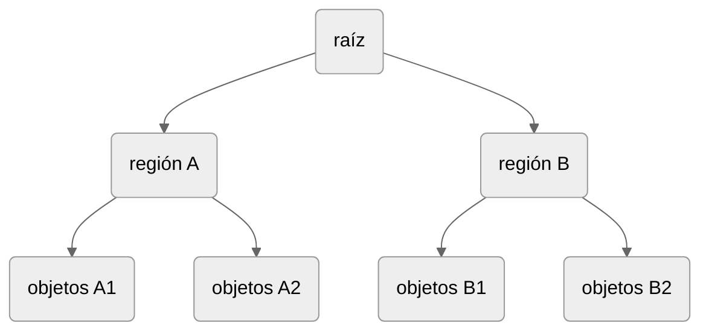
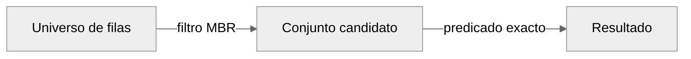

::::{dropdown} Datos, contexto del caso y alcance

**Datos**

El plano del caso mide 120x80 unidades abstractas, con coordenadas `(x,y)` y 
`SRID 0`. Los registros proceden de la base de datos `red_agua`.

| ID  | Punto             |   x |  y | Capacidad m³ | Sector declarado  |
|:---:|:------------------|----:|---:|---:|:-----------------:|
|  1  | Hospital Norte    |  20 | 65 | 40 |       Norte       |
|  2  | Estadio Municipal |  90 | 60 | 55 |       Norte       |
|  3  | Escuela Sur       |  25 | 20 | 30 |        Sur        |
|  4  | Terminal Rural    |  80 | 15 | 35 |        Sur        |
|  5  | Plaza Frontera    |  60 | 40 | 20 |       Norte       |
|  6  | Reserva Oriente   | 110 | 35 | 25 |       Norte       |

:::{figure} cap6_figs/01_red_agua.svg
:alt: Seis puntos de RedAgua distribuidos en un plano de 120 por 80 unidades; P5 está en y igual a 40 y P6 se localiza al sur de esa frontera.
:label: cap6-red-agua

Distribución de los datos originales. P5 se encuentra en la frontera entre sectores.
:::

**Alcance**

- Los ejemplos utilizan MySQL 8.0.18 o posterior dentro de la serie 8.0 y el motor InnoDB. 
- Se presupone que la base `red_agua` y la tabla `ra3_punto` fueron creadas en los capítulos anteriores.
- Se consideran geometrías bidimensionales, válidas, no vacías y en el mismo sistema cartesiano. 
- Las coordenadas de RedAgua expresan unidades abstractas.
- El SRID 0 no establece por sí solo una unidad física. 
- Las figuras y agrupaciones del árbol son construcciones didácticas, no representaciones del almacenamiento interno observado en MySQL.

::::


## 1. Resultado lógico y acceso físico

Una **ventana de consulta** es la región geométrica usada para delimitar una búsqueda. Cambiar la ventana modifica la condición espacial, aunque el conjunto resultado podría coincidir, mientras que crear un índice busca cambiar la forma de acceder a los datos.

El **resultado lógico** es el conjunto de filas que satisface el requerimiento. El **acceso físico** es la estrategia que utiliza el gestor para encontrarlas, por ejemplo recorrer la tabla o consultar una estructura de acceso. Si dos estrategias implementan la misma condición sobre los mismos datos, deben conservar ese conjunto.

Considere la definición de una zona triangular de inspección en la región de estudio del sistema RedAgua ([](#cap6-fig-zona-triangular)).

:::{figure} cap6_figs/03_triangulo_prediccion.svg
:alt: Zona triángular
:label: cap6-fig-zona-triangular

Distribución de los datos originales. La región verde es la zona de inspección.
:::

La recta que contiene el lado oblicuo del triángulo interseca los ejes coordenados en los puntos $(120,0)$ y $(0,80)$. Por tanto, su ecuación en forma de interceptos es:

$$ \frac{x}{120}+\frac{y}{80}=1 $$

Al multiplicar ambos miembros por $240$, se obtiene:

$$ 2x+3y=240 $$

Como el origen satisface la desigualdad $2x+3y\leq 240$, esta determina el semiplano que contiene el interior del triángulo. Al intersectarlo con los semiplanos $x\geq 0$ e $y\geq 0$, se obtiene la zona triangular de inspección, incluida su frontera:

$$ T=\{(x,y):x\geq 0,\ y\geq 0,\ 2x+3y\leq 240\} $$

Las restricciones $x\geq 0$ e $y\geq 0$ son necesarias para delimitar el triángulo en el primer cuadrante.

La posición de los puntos respecto de este triángulo puede determinarse comparando el valor de $2x+3y$ con $240$. Un valor menor indica interior, uno igual, frontera, y uno mayor, exterior.


| ID | Coordenadas $(x,y)$ |                   Evaluación | Localización  |
|---|:---:|-----------------------------:|:-------------:|
| `P1` | $(20,65)$ |  $2\cdot20+3\cdot65=235<240$ |   Interior    |
| `P2` | $(90,60)$ |  $2\cdot90+3\cdot60=360>240$ |   Exterior    |
| `P3` | $(25,20)$ |  $2\cdot25+3\cdot20=110<240$ |   Interior    |
| `P4` | $(80,15)$ |  $2\cdot80+3\cdot15=205<240$ |   Interior    |
| `P5` | $(60,40)$ |      $2\cdot60+3\cdot40=240$ |   Frontera    |
| `P6` | $(110,35)$ | $2\cdot110+3\cdot35=325>240$ |   Exterior    |

En consecuencia, la consulta que incluye tanto el interior como la frontera debe recuperar los puntos `P1`, `P3`, `P4` y `P5`.

Para expresar este requerimiento en MySQL, puede utilizarse `ST_Intersects()`: cuando se aplica a un polígono y un punto, devuelve verdadero si el punto pertenece al interior del polígono o a su frontera [@oracle_shapes].

(consulta-referencia)=
:::{code-block} sql
:linenos: true

SET @zona = ST_GeomFromText('POLYGON((0 0,120 0,0 80,0 0))', 0);
SELECT id_punto, codigo
FROM ra3_punto
WHERE ST_Intersects(@zona, ubicacion);
:::

Esta consulta define el resultado requerido, pero no el método de acceso. MySQL puede,
1. recorrer toda la tabla, 
2. utilizar un índice espacial para seleccionar candidatos o, 
3. si existen condiciones adicionales, emplear un índice sobre atributos no espaciales.

La elección depende del costo estimado, considerando el tamaño de la tabla, la selectividad y las estadísticas disponibles. La existencia de un índice no garantiza su uso.

Los índices consumen espacio y requieren mantenimiento cuando cambian los datos. Su beneficio debe compensar estos costos: los índices innecesarios aumentan el almacenamiento y el trabajo de escritura [@mysqlOptimizationIndexes2026].


## 2. Rectángulo mínimo envolvente (MBR)

Un rectángulo mínimo envolvente, **MBR** (*minimum bounding rectangle*), es el menor rectángulo alineado con los ejes que contiene una geometría. Para una geometría plana no vacía queda definido por sus extremos:

$$\operatorname{MBR}(g)=[x_{\min},x_{\max}]\times[y_{\min},y_{\max}].$$

En una línea diagonal, el rectángulo incluye superficie ajena a la línea. En un polígono irregular, omite detalles de forma, concavidades y huecos (ver [](#cap6-fig-mbr)). Su utilidad consiste en representar la extensión con pocos valores, adecuados para comparaciones y agrupamientos.

:::{figure} cap6_figs/02_mbr_formas.svg
:alt: Un punto, una línea diagonal y un polígono en L con sus cajas alineadas con los ejes.
:label: cap6-fig-mbr

Tres geometrías auxiliares. En el polígono con forma de L, `(4,4)` pertenece a la envolvente y no al polígono. Los MBR de punto y línea muestran que el rectángulo puede ser degenerado y que el área de la caja no equivale a área del objeto, respectivamente.
:::

En el polígono cóncavo auxiliar de la [](#cap6-fig-mbr), los vértices son `(1,1), (5,1), (5,2), (2,2), (2,5), (1,5)`. La caja tiene un área de 16 unidades cuadradas y el polígono un área de 7 unidades cuadradas. Hay 9 unidades cuadradas de la caja que no pertenecen a la forma. Esta diferencia ilustra la pérdida de información.

Si las envolventes de dos geometrías no intersecan, sus formas tampoco pueden hacerlo. La recíproca no está garantizada, cajas superpuestas pueden contener formas disjuntas.

Para dos cajas cerradas $A$ y $B$, existe intersección cuando sus intervalos se intersectan en ambos ejes:

\begin{align}
A_{x_{\min}} &\leq B_{x_{\max}}, &
B_{x_{\min}} &\leq A_{x_{\max}}, \\
A_{y_{\min}} &\leq B_{y_{\max}}, &
B_{y_{\min}} &\leq A_{y_{\max}}.
\end{align}

Las cuatro condiciones deben cumplirse simultáneamente, basta que una no se cumpla para descartar la intersección. El uso de $\leq$ incluye los contactos de frontera, incluso en un borde o un vértice.

MySQL distingue las relaciones entre envolventes de las relaciones entre formas originales [@oracle_mbr]. Por ejemplo, dos líneas que no se tocan pueden tener MBR superpuestos, esto es, `MBRIntersects()` devuelve `1`, mientras que `ST_Intersects()` devuelve `0`. Ambos resultados son correctos porque evalúan objetos distintos.

MySQL dispone de funciones `MBR…()` que evalúan relaciones entre los rectángulos envolventes de dos geometrías. Aunque reciben las geometrías originales como argumentos. Estas funciones comparan sus envolventes, evalúan las formas exactas, como `ST_Intersects()`..

A continuación se resume la descripción de algunas funciones. Los argumentos `a` y `b` representan geometrías.

| Función              | Relación evaluada entre las envolventes                                          |
|:---------------------|:---------------------------------------------------------------------------------|
| `MBRIntersects(a,b)` | Comparten al menos un punto, incluido un contacto en la frontera.                |
| `MBRDisjoint(a,b)`   | No comparten ningún punto.                                                       |
| `MBRContains(a,b)`   | La envolvente de `a` contiene la de `b`.                                         |
| `MBRWithin(a,b)`     | Relación inversa de contención, equivale a `MBRContains(b,a)`.                   |
| `MBRCovers(a,b)`     | Ningún punto de la envolvente de `b` queda fuera de la de `a`.                   |
| `MBRCoveredBy(a,b)`  | Relación inversa de cobertura, equivale a `MBRCovers(b,a)`.                      |
| `MBREquals(a,b)`     | Las envolventes son iguales, aunque las formas originales pueden ser diferentes. |


::::{hint} Ejemplo: interior de la caja, frontera y forma exacta.

Retomando la zona triangular de inspección de RedAgua:

$$ T=\{(x,y):x\geq 0,\ y\geq 0,\ 2x+3y\leq 240\}. $$

Su envolvente es:

$$ \operatorname{MBR}(T)=[0,120]\times[0,80]. $$

:::{figure} cap6_figs/03_triangulo_resuelto.svg
:alt: Zona triangular de inspección
:label: cap6-zona-inspeccion

La línea naranja discontinua es el MBR y la región verde es la zona de inspección. Círculos: interior, cuadrado: frontera incluida, cruces: falsos positivos.
:::

Considerando,

- `P3` situado en el interior del triángulo.
- `P2` situado fuera del triángulo pero dentro de su caja.
- `P5` situado sobre la diagonal.
- `B = (0,20)` situado en el borde del triángulo y de su envolvente.

La evaluación con algunas funciones se describen a continuación. Para efectos de comparar también se incluye el resultado entregado por `ST_Intersects()`, que evalúa geometrías.

| Punto| `MBRContains` | `MBRCovers` | `MBRIntersects` | `ST_Intersects`  |
|:----:|:--------------:|:-----------:|:---------------:|:----------------:|
| `P3` |       1        |      1      |        1        |        1         |
| `P2` |       1        |      1      |        1        |        0         |
| `P5` |       1        |      1      |        1        |        1         |
| `B`  |       0        |      1      |        1        |        1         |

- `P3`: coincidencia entre caja y forma. Se encuentra dentro del MBR y de la zona de inspección. 
- `P2`: falso positivo respecto de forma. Se encuentra dentro del MBR, pero fuera de la zona de inspección. 
- `P5`: frontera de la forma. Se encuentra dentro del MBR y sobre la diagonal del triángulo.
- `B`: frontera de la forma y de la caja. Se encuentra sobre el borde del MBR.

::::

## 3. R-tree

Un **R-tree** es un árbol de búsqueda balanceado por altura que agrupa entradas mediante rectángulos envolventes jerárquicos. Todas sus hojas se encuentran al mismo nivel. Las entradas internas contienen una envolvente y una referencia a un nodo hijo. Las entradas de las hojas asocian la envolvente de un objeto con su identificador. Las envolventes de distintos hijos pueden solaparse [@guttman1984rtrees].



Los índices ordinarios de InnoDB emplean B-trees, los índices espaciales utilizan R-trees para organizar datos multidimensionales [@mysqlInnoDBPhysical2026].

La [](#cap6-fig-rtree-ejemplo) muestra un recorrido para $Q=[15,30]\times[10,30]$. En la raíz se comparan las envolventes de las entradas $A$ y $B$ con la ventana. Se conserva $A$ porque ambas regiones intersecan y se descarta $B$ porque $Q_{x_{\max}}=30 < B_{x_{\min}}= 80$. Se desciende por la referencia de $A$ y se examinan sus entradas: P1 y P5 quedan fuera y P3 coincide. La poda de $B$ evita examinar sus tres entradas individuales en este recorrido conceptual.

:::{figure} cap6_figs/04_rtree_recorrido.svg
:alt: Dos grupos de tres puntos y un árbol de dos ramas; la ventana permite descartar el grupo B.
:label: cap6-fig-rtree-ejemplo

Muestra dos rectángulos sobre el plano (izquierda) y las conexiones del árbol (derecha). Cada rectángulo representa una región geométrica, mientras que cada flecha representa una referencia a otro nivel. Esquema conceptual que no representa la estructura efectivamente construida por MySQL.
:::

:::{note} Ejercicio C6-E1. Recorrido de una ventana.
:class: dropdown

Para una ventana,

$$Q = [85,100] \times [50,70]$$

- ¿Qué región ($A$ o $B$) se descarta y con qué desigualdad?
- ¿Qué punto coincide?
- ¿Por qué una ventana puede coincidir con dos ramas y no encontrar puntos?
:::

Las regiones pueden **solaparse**, por lo que una búsqueda puede recorrer más de una rama. La cantidad de ramas visitadas depende de la ventana y del solapamiento de las envolventes [@guttman1984rtrees]. 

Por ejemplo, la [](#cap6-fig-rtree-solapamiento) permite diferenciar tres situaciones: 
- una rama candidata, 
- una entrada de objeto candidata y
- un resultado exacto. 

Visitar una rama no garantiza que sus hojas produzcan candidatos.

:::{figure} cap6_figs/05_rtree_solapamiento.svg
:alt: Las envolventes de dos grupos de puntos se solapan; una ventana interseca ambas sin contener puntos.
:label: cap6-fig-rtree-solapamiento

Agrupación alternativa: `A′` reúne `IDs: 1`,`2`,`3` y su MBR es `[20,90] × [20,65]`. `B′` reúne `IDs: 4,5,6` y su MBR es `[60,110] × [15,40]`. La ventana `[65,75] × [25,30]` interseca ambas regiones, pero no contiene ningún punto original.
:::

## 4. Filtro y refinamiento espacial

Una consulta espacial puede estructurarse conceptualmente en dos etapas:



- El **filtro** selecciona candidatos mediante una condición necesaria para satisfacer la consulta y, habitualmente, menos costosa de evaluar que la relación geométrica exacta. 
- El **refinamiento** comprueba cuáles de esos candidatos cumplen el predicado que define la respuesta solicitada. 

La siguiente consulta identifica los puntos cuya ubicación interseca la zona de inspección almacenada en `@zona`, incluyendo su frontera. Para esto, `MBRIntersects()` compara los MBR y `ST_Intersects()` evalúa la relación entre las formas exactas [@oracle_mbr; @oracle_shapes].

:::{code-block} sql
:linenos:

SET @zona = ST_GeomFromText('POLYGON((0 0,120 0,0 80,0 0))',0);
SELECT id_punto, codigo
FROM ra3_punto
WHERE MBRIntersects(@zona, ubicacion)
  AND ST_Intersects(@zona, ubicacion)
ORDER BY id_punto;
:::

El orden de las condiciones en `WHERE` no impone su orden físico de evaluación ni garantiza que se utilice un índice.

Para geometrías válidas, no vacías y en un mismo sistema cartesiano, la intersección implica que sus envolventes también intersecan. Por esta razón, `MBRIntersects()` se considera un **filtro conservador**, porque admite falsos positivos que pueden ser descartados por el refinamiento, pero conserva todas las coincidencias exactas. Esta garantía no se extiende necesariamente a otros predicados `MBR...()`. Las envolventes también sustentan la organización espacial de los R-trees [@guttman1984rtrees].

Sean $\mathcal{D}$ el conjunto de identificadores de la tabla, $\mathcal{C}$ los candidatos y $\mathcal{R}$ la respuesta exacta. La propiedad conservadora se expresa como:

$$\mathcal{R}\subseteq\mathcal{C}\subseteq\mathcal{D}$$

En consecuencia, refinar los candidatos conserva la respuesta: 

$$\mathcal{C}\cap\mathcal{R}=\mathcal{R}$$ 

El término *exacto* distingue la evaluación de la forma de la comparación de envolventes, es decir, no implica ausencia de limitaciones numéricas en la representación computacional.

Para observar las dos etapas, pueden ejecutarse las condiciones por separado:

:::{code-block} sql
:linenos:
SET @zona = ST_GeomFromText('POLYGON((0 0,120 0,0 80,0 0))',0);

-- Candidatos del filtro MBR.
SELECT id_punto, codigo
FROM ra3_punto
WHERE MBRIntersects(@zona, ubicacion)
ORDER BY id_punto;

-- Respuesta exacta de referencia.
SELECT id_punto, codigo
FROM ra3_punto
WHERE ST_Intersects(@zona, ubicacion)
ORDER BY id_punto;
:::

Para un punto y una zona poligonal, `ST_Intersects()` devuelve `1` si el punto está dentro de la zona o sobre su frontera [@oracle_shapes]. La consulta combinada debe devolver el mismo conjunto de identificadores que la consulta de referencia. Notar que, comparar solo el número de filas no basta, porque cantidades iguales pueden corresponder a registros diferentes.

### Recuentos y falsos positivos

Para una consulta fija, se definen:

- $N=|\mathcal{D}|$: número total de registros de la tabla.
- $C=|\mathcal{C}|$: número de candidatos que cumplen `MBRIntersects()`.
- $R=|\mathcal{R}|$: número de registros que cumplen el predicado exacto `ST_Intersects()`.

Considerando que el filtro conserva todas las coincidencias exactas, se cumple que,

$$ 0 \leq R \leq C \leq N. $$

Un **falso positivo del filtro** es un registro que cumple `MBRIntersects()`, pero no `ST_Intersects()`. Por ejemplo,

:::{code-block} sql
:linenos:
SET @zona = ST_GeomFromText('POLYGON((0 0,120 0,0 80,0 0))',0);

SELECT id_punto, codigo
FROM ra3_punto
WHERE MBRIntersects(@zona, ubicacion)
  AND NOT ST_Intersects(@zona, ubicacion)
ORDER BY id_punto;
:::

La cantidad de falsos positivos ($FP$) viene dada por,

$$ FP=C-R. $$

Los tres recuentos pueden obtenerse en una misma consulta con los datos del ejemplo:

:::{code-block} sql
:linenos:
SET @zona = ST_GeomFromText('POLYGON((0 0,120 0,0 80,0 0))',0);

SELECT
    COUNT(*) AS N,
    COUNT(CASE WHEN MBRIntersects(@zona, ubicacion) THEN 1 END) AS C,
    COUNT(CASE WHEN ST_Intersects(@zona, ubicacion) THEN 1 END) AS R
FROM ra3_punto;
:::

### Selectividad

La **selectividad del filtro** puede definirse como la fracción de registros que supera la condición MBR:

$$ S_{\mathrm{filtro}}=\frac{C}{N},  \qquad N>0. $$

Con esta convención, un valor menor indica que el filtro conserva una fracción menor de registros y, por tanto, es más restrictivo. Su complemento representa la proporción descartada:

$$ D_{\mathrm{filtro}} = 1-S_{\mathrm{filtro}} = \frac{N-C}{N}. $$

La **proporción de falsos positivos entre los candidatos** indica la fracción de ellos que es eliminada por el refinamiento:

$$ P_{\mathrm{FP}\mid\mathrm{candidato}} = \frac{C-R}{C}, \qquad C>0. $$

Ambas medidas describen aspectos diferentes, 
- $C/N$, indica la proporción del total que conserva el filtro y, 
- $(C-R)/C$, la proporción de candidatos que no pertenecen a la respuesta exacta. 

Por esta razón, un filtro puede conservar pocos registros y presentar una proporción elevada de falsos positivos. Esta última medida usa como denominador los candidatos ($C$), y no debe confundirse con la tasa de falsos positivos respecto de los registros que incumplen el predicado exacto, cuyo denominador es $N-R$.

Si $C=0$, la propiedad conservadora implica $R=0$, y la proporción de falsos positivos entre candidatos se registra como no aplicable. Si $N=0$, tampoco se define la selectividad.

:::{hint} Ejemplo: Triángulo de inspección

Para el triángulo original, los recuentos esperados son:

$$ N=6,\qquad C=6,\qquad R=4. $$

Por tanto,

$$ S_{\mathrm{filtro}} = \frac{6}{6} = 1 = 100\,\%, $$

$$ D_{\mathrm{filtro}} = \frac{6-6}{6} = 0, $$

$$ F=6-4=2, \qquad P_{\mathrm{FP}\mid\mathrm{candidato}} = \frac{2}{6} = \frac{1}{3} \approx33{,}3\,\% $$

El filtro conserva los seis registros y no descarta ninguno. El refinamiento elimina dos candidatos y devuelve cuatro puntos. En consecuencia, un tercio de los candidatos corresponde a falsos positivos.

Estos recuentos se deducen de las coordenadas del caso didáctico y no constituyen mediciones del rendimiento del servidor.
:::

Para puntos y una ventana rectangular cerrada, alineada con los ejes, el filtro MBR y la evaluación exacta coinciden ($C=R$), siempre que traten la frontera del mismo modo. En ventanas triangulares o cóncavas pueden aparecer falsos positivos, que el refinamiento elimina. La proporción de candidatos y de falsos positivos depende de la geometría de consulta y de la distribución de los datos.


::::{hint} Ejemplo: Consultas con distancia

Considere detectar los puntos de la RedAgua que se encuentran a $~30$ unidades o menos de una localización situada en $C=(60,40)$.

**Definición de la condición** 

Un punto $P=(x,y)$ pertenece al resultado cuando su distancia al centro cumple:

$$ d(P,C)=\sqrt{(x-60)^2+(y-40)^2}\leq 30 $$

Desde el punto de vista geométrico, se busca seleccionar los puntos dentro del círculo o sobre su circunferencia. Un filtro espacial conservador puede reducir los candidatos que requieren calcular la distancia, sin excluir resultados válidos. Sin embargo, el costo efectivo de la consulta depende del plan de ejecución.

**Construcción del filtro**

Todo el círculo está contenido en una caja cuyos límites se calculan restando y sumando el radio a cada coordenada del centro:

$$x_{\min}=60-30=30,\qquad x_{\max}=60+30=90$$
$$y_{\min}=40-30=10,\qquad y_{\max}=40+30=70$$

Por tanto:

$$\text{Caja}=[30,90]\times[10,70]$$

Esta caja envolvente contiene el círculo y algunas regiones exteriores (ver [](#cap6-fig-ejemplo-distancia)). Pertenecer a ella es una condición necesaria, pero no suficiente. Los puntos dentro o sobre su borde se conservan como candidatos, y los exteriores se descartan sin excluir resultados válidos.

:::{figure} cap6_figs/07_radio.svg
:alt: Círculo de radio 30 centrado en (60,40) dentro de su caja; P2 y P4 quedan fuera del círculo.
:label: cap6-fig-ejemplo-distancia

La línea segmenta representa la caja envolvente y el círculo verde el radio de búsqueda.
:::

**Aplicación del filtro**

El filtro conserva los puntos cuyas coordenadas cumplen simultáneamente:

$$ 30\leq x\leq90 \quad \text{y} \quad 10\leq y\leq70 $$

|  ID  |    $x$ |   $y$ | ¿Interseca la caja? | Decisión       |
|:----:|-------:|------:|:--------------------|:---------------|
| `P1` |  $ 20$ | $ 65$ | No: $x<30$          | Descartar      |
| `P2` |  $ 90$ | $ 60$ | Sí, borde derecho   | Conservar      |
| `P3` |  $ 25$ | $ 20$ | No: $x<30$          | Descartar      |
| `P4` |  $ 80$ | $ 15$ | Sí                  | Conservar      |
| `P5` |  $ 60$ | $ 40$ | Sí                  | Conservar      |
| `P6` | $ 110$ | $ 35$ | No: $x>90$          | Descartar      |

Solo se consideran como candidatos a `P2`, `P4` y `P5`.

**Aplicación del refinamiento**

Se calculan las distancias de los candidatos:

| ID | Distancia ($d$)                            |     $d\leq30$     |
|---:|:-------------------------------------------|:-----------------:|
| `P2` | $\sqrt{(90-60)^2+(60-40)^2} \approx36.056$ |        No         |
| `P4` | $\sqrt{(80-60)^2+(15-40)^2} \approx32.016$ |        No         |
| `P5` | $\sqrt{(60-60)^2+(40-40)^2} = 0$           |        Sí         |

En conclusión, los `P2` y `P4` son falsos positivos del filtro. Están contenidos en la caja, pero no satisfacen la consulta.

**Implementación progresiva de la solución en SQL**

:::{code-block} sql
:linenos:

SET @centro = ST_GeomFromText('POINT(60 40)', 0);
SET @caja = ST_GeomFromText('POLYGON((30 10, 90 10, 90 70, 30 70, 30 10))',0);

-- 1. Identificación de candidatos
SELECT
    id_punto,
    ST_AsText(ubicacion) AS coordenadas,
    ST_Distance(ubicacion, @centro) AS distancia
FROM ra3_punto
WHERE MBRIntersects(ubicacion, @caja)
ORDER BY id_punto;

-- 2. Filtro + refinamiento
SELECT
    id_punto,
    ST_AsText(ubicacion) AS coordenadas,
    ST_Distance(ubicacion, @centro) AS distancia
FROM ra3_punto
WHERE MBRIntersects(ubicacion, @caja)
  AND ST_Distance(ubicacion, @centro) <= 30
ORDER BY id_punto;
:::
::::

:::{note} Ejercicio C6-E2. Consulta con filtro.
:class: dropdown

Formule en SQL una solución progresiva que aplique una estrategia de filtro y refinamiento para encontrar los puntos situados a una distancia menor o igual que $~28$ unidades de la posición $(91,43)$.
 

1. Calcule las coordenadas mínima y máxima de la nueva caja conservadora.
2. Identifique los puntos que pasan el filtro `MBRIntersects`.
3. Calcule la distancia de cada candidato y determine el resultado exacto.
4. Identifique los falsos positivos.
5. Escriba la consulta SQL que combina filtro y refinamiento.
:::

## 5. Índice espacial

Un **índice espacial** es una estructura auxiliar de acceso sobre una columna geométrica. Organiza información espacial para localizar candidatos sin sustituir la geometría almacenada ni modificar la regla de consulta. En InnoDB, los índices `SPATIAL` utilizan R-trees [@mysqlInnoDBPhysical2026].

MySQL 8.0 exige que la columna de un índice espacial sea `NOT NULL`. Para que el optimizador considere el índice, la columna debe tener una restricción explícita de SRID. Esto permite su consideración, pero no obliga a elegirlo para cada consulta [@mysqlCreateIndex2026; @mysqlSpatialIndexOptimization2026].

En RedAgua se utiliza `ubicacion POINT NOT NULL SRID 0`. Sus propiedades se inspeccionan mediante:

:::{code-block} sql
:linenos:
SELECT IS_NULLABLE, DATA_TYPE, SRS_ID
FROM INFORMATION_SCHEMA.COLUMNS
WHERE TABLE_SCHEMA = DATABASE()
  AND TABLE_NAME = 'ra3_punto'
  AND COLUMN_NAME = 'ubicacion';
:::

| Propiedad     | Valor esperado | Interpretación                           |
|:--------------|:---------------|:-----------------------------------------|
| `IS_NULLABLE` | `NO`           | No admite valores nulos.                 |
| `DATA_TYPE`   | `point`        | Almacena puntos.                         |
| `SRS_ID`      | `0`            | Restringe explícitamente el SRID a cero. |

Un índice `SPATIAL` comprende una sola columna espacial, no admite longitud de prefijo y no puede declararse primario ni único [@mysqlCreateIndex2026]. El siguiente bloque crea una tabla auxiliar y copia los seis puntos. Ejecútelo una sola vez; si la tabla ya existe, inspeccione su contenido antes de continuar.

:::{code-block} sql
:linenos:
CREATE TABLE ra7_inspeccion_demo (
    id_punto INT PRIMARY KEY,
    codigo VARCHAR(100),
    capacidad_m3 DECIMAL(12,2),
    ubicacion POINT NOT NULL SRID 0
) ENGINE = InnoDB;

INSERT INTO ra7_inspeccion_demo
    (id_punto, codigo, capacidad_m3, ubicacion)
SELECT id_punto, codigo, capacidad_m3, ubicacion
FROM ra3_punto;

CREATE SPATIAL INDEX idx_ra7_demo_ubicacion
ON ra7_inspeccion_demo (ubicacion);

SHOW INDEX FROM ra7_inspeccion_demo;
:::

En la fila del índice espacial se esperan `Key_name = idx_ra7_demo_ubicacion`, `Column_name = ubicacion` e `Index_type = SPATIAL`. La fila de `PRIMARY` corresponde a otra estructura, la clave primaria sobre `id_punto`.

La existencia del índice no implica que una consulta lo utilice. Una fracción candidata pequeña puede favorecerlo, pero la elección depende del costo estimado. En tablas pequeñas o consultas que recuperan muchas filas, un recorrido completo puede ser razonable [@oracle_table_scans].

## 6. Análisis del plan

`EXPLAIN` muestra el plan previsto por el optimizador. Para conservar el requerimiento inclusivo, se utiliza una ventana cerrada y el filtro `MBRIntersects`:

:::{code-block} sql
:linenos:
SET @ventana = ST_GeomFromText('POLYGON((20 20,40 20,40 40,20 40,20 20))', 0);

EXPLAIN FORMAT=TRADITIONAL
SELECT id_punto
FROM ra7_inspeccion_demo
WHERE MBRIntersects(@ventana, ubicacion)
  AND ST_Intersects(@ventana, ubicacion);
:::

La consulta subyacente devuelve `P3`. `EXPLAIN` presenta el plan, no la respuesta a la consulta. Para el contexto, el refinamiento es redundante, solo se conserva para hacer visible el patrón de consulta.

| Campo           | Interpretación                                                               |
|:----------------|:-----------------------------------------------------------------------------|
| `possible_keys` | Índices potencialmente relevantes para localizar filas.                      |
| `key`           | Índice seleccionado, puede ser `NULL`.                                       |
| `type`          | Método de acceso, por ejemplo, `range` o `ALL`.                              |
| `rows`          | Número estimado de filas por examinar.                                       |
| `filtered`      | Porcentaje estimado de filas examinadas que supera la condición de la tabla. |
| `Extra`         | Información adicional sobre operaciones o evaluación de condiciones.         |

- `rows` no representa el número exacto de respuestas. 
- `ALL` indica un recorrido completo de la tabla y no constituye por sí mismo un error de optimización.

Los formatos alternativos `TREE` y `JSON` muestran el plan de otra forma. No contienen necesariamente las mismas columnas del formato tradicional.[@mysqlExplain2026].

Por otra parte, `EXPLAIN ANALYZE` ejecuta `SELECT` y presenta información observada, incluidos tiempos, filas y bucles de los operadores. Sus mediciones incluyen instrumentación y no deben confundirse con el tiempo total percibido por un cliente [@mysqlExplain2026].

:::{code-block} sql
:linenos:

EXPLAIN ANALYZE
SELECT id_punto
FROM ra7_inspeccion_demo
WHERE MBRIntersects(@ventana, ubicacion)
  AND ST_Intersects(@ventana, ubicacion);
:::

Para comparar la disponibilidad del índice espacial sin eliminarlo, se puede ejecutar el mismo predicado con `IGNORE INDEX`:

:::{code-block} sql
:linenos:

EXPLAIN FORMAT=TRADITIONAL
SELECT id_punto
FROM ra7_inspeccion_demo IGNORE INDEX (idx_ra7_demo_ubicacion)
WHERE MBRIntersects(@ventana, ubicacion)
  AND ST_Intersects(@ventana, ubicacion);

:::

Esta variante impide considerar el índice indicado. La variante sin la cláusula permite considerarlo, pero no fuerza su selección. Por ello, los planes deben inspeccionarse antes de atribuir una diferencia temporal al índice.

## 7. Estadísticas y administración básica

`ANALYZE TABLE` actualiza estadísticas sobre la distribución de las claves de los índices que sirven de apoyo al optimizador. No crea el índice ni garantiza una mejora de tiempo. En InnoDB, la documentación recomienda analizar la tabla después de crear un índice cuando están habilitadas las estadísticas persistentes [@mysqlCreateIndex2026].

```sql
ANALYZE TABLE ra7_inspeccion_demo;
```

La actualización de estadísticas es diferente del mantenimiento de las entradas del índice. El gestor mantiene estas últimas cuando las operaciones sobre las filas lo requieren.

`ANALYZE TABLE` y las instrucciones DDL utilizadas aquí, como `CREATE INDEX`, provocan confirmaciones implícitas. 


## 8. Ejercicios

**C6-E3.** Considere `LINESTRING(0 0,2 2)` y `LINESTRING(0 1,0.4 1.4)`. Determine sus MBR, evalúe antes de ejecutar las funciones `MBRIntersects` y `ST_Intersects` y justifique por qué ambos resultados pueden diferir.

**C6-E4.** Para el triángulo original (zona de inspección) y el punto auxiliar $(0,20)$, compare `MBRContains(@zona,@p)`, `MBRIntersects(@zona,@p)` y `ST_Intersects(@zona,@p)`. ¿Qué ocurre si se combina la primera función con el predicado exacto?

**C6-E5.** Una columna se declara `ubicacion POINT NULL`. Distinga el requisito que impide crear un índice espacial del que impide que el optimizador lo considere. Indique qué debe auditarse antes de cambiar la definición.

**C6-E6.** Sobre 10.000 registros, la envolvente $ A$ conserva 100 candidatos y 50 coincidencias. La envolvente $ B$ conserva 2.000 candidatos y 1.900 coincidencias. Calcule la selectividad del filtro y la proporción de falsos positivos entre los candidatos. ¿Es posible determinar cuál consulta es más rápida?

**C6-E7.** Dos consultas devuelven los identificadores $\{1,3,4,5\}$ y $\{1,2,4,5\}$. Explique por qué no son equivalentes y adapte la comprobación de diferencia de conjuntos para detectarlo.

**C6-E8.** Considere los siguientes planes,

| Plan  | `key`                    | `type`  | `rows` |
|:-----:|:-------------------------|:--------|---:|
|  `A`  | `idx_ra7_demo_ubicacion` | `range` | `120` |
|  `B`  | `NULL`                   | `ALL`   | `10.000` |

- ¿Qué plan utiliza el índice? 
- ¿`120` significa respuestas exactas? 
- ¿El Plan `A` es más rápido que `B`?

## Resumen

- MBR aproxima la extensión.
- R-tree organiza envolventes para podar búsquedas.
- El filtro conserva candidatos y el refinamiento evalúa la relación geométrica requerida. 
- La existencia de un índice, su selección por el optimizador y su beneficio temporal son evidencias distintas.